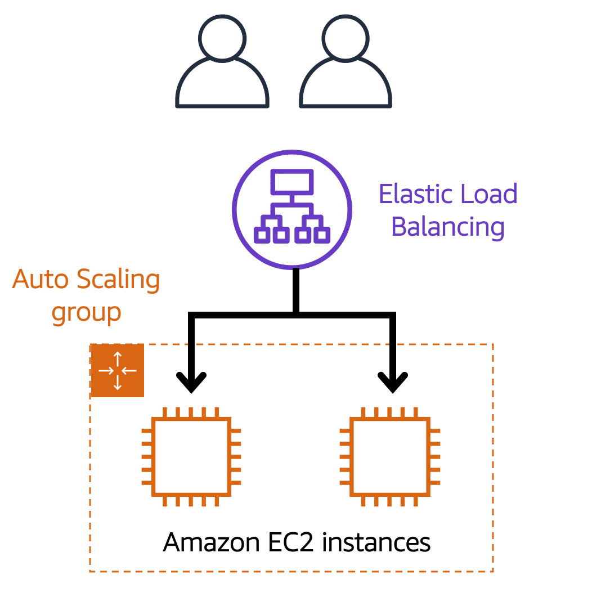
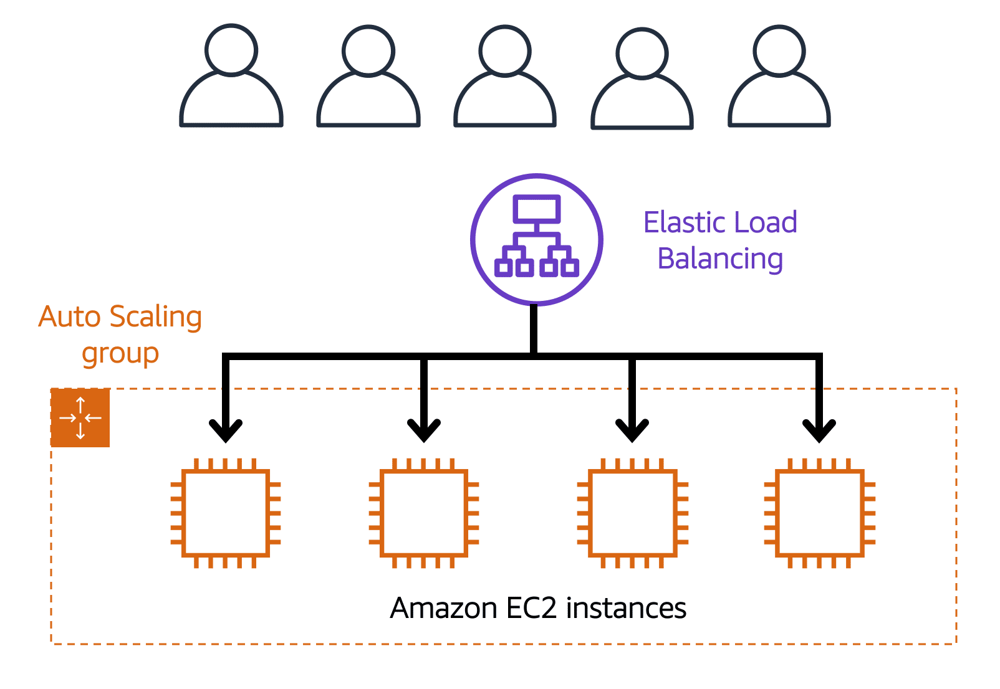
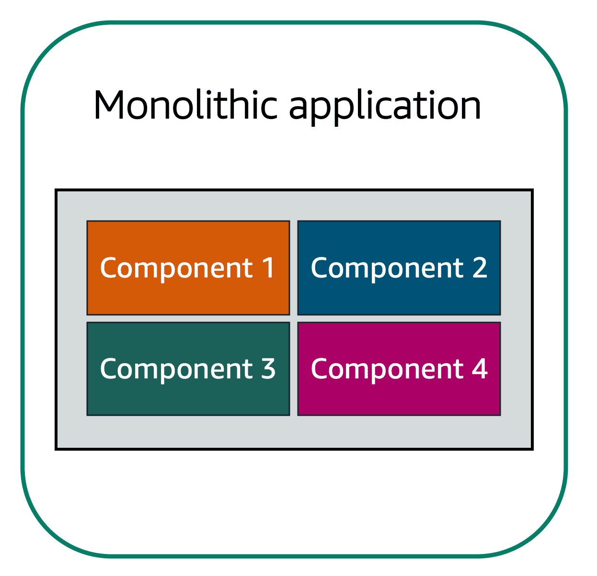
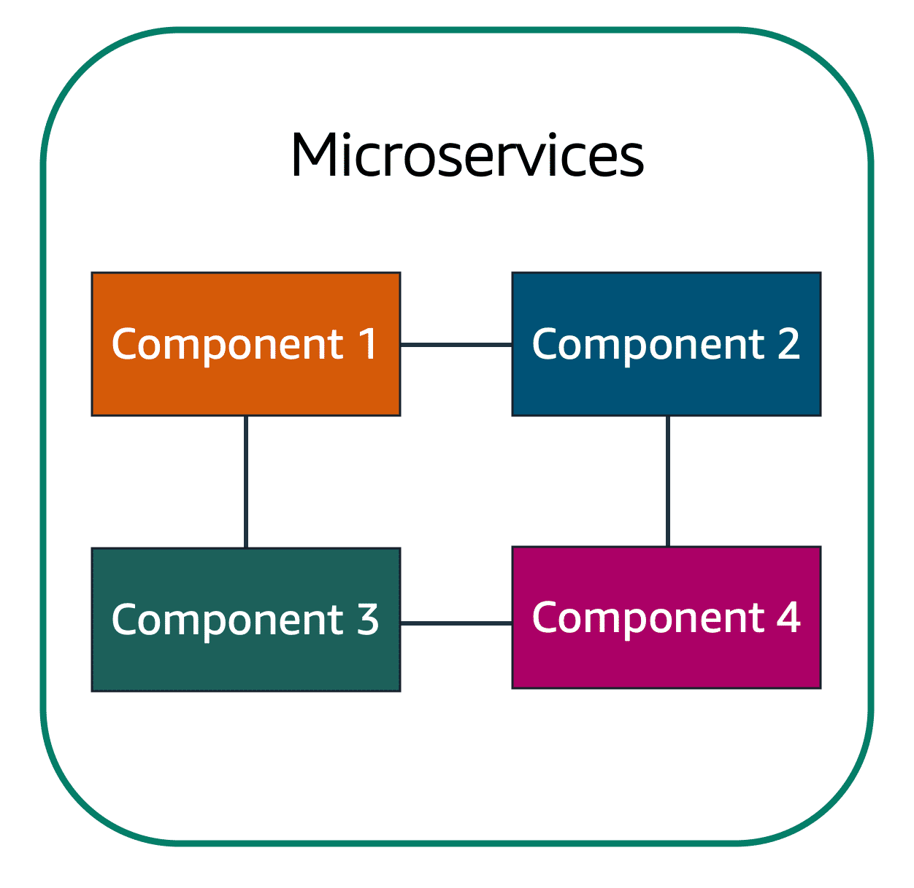
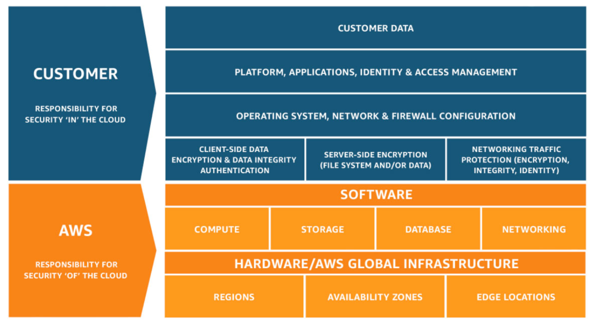

# AWS Cloud Practitioner Notes

Online Training: https://explore.skillbuilder.aws/learn/course/134/play/62437/aws-cloud-practitioner-essentials

## Introduction to AWS
	1. Client-Server Model
		- Client - Can be a web browser or desktop application that a person interacts with to make requests to computer servers.
		- Server - can be services such as Amazon Elastic Compute Cloud (Amazon EC2), a type of virtual server.
	2. Cloud Computing
		- Cloud-Based Deployment
			- Run all parts of the application in the cloud
			- Migrate existing applications to the cloud
			- Design and build new applications in the cloud
		- On-Premises Deployment (Private Cloud)
			- Deploy resources by using virtualization and resource management tools
			- Increase resource utilization by using application management and virtualization technologies
		- Hybrid Deployment
			- Connect cloud-based resources to on-premises infrastructure
			- Integrate cloud-based resources with legacy IT applications
	3. Benefits of Cloud Computing
		- Trade upfront expense for variable expense
		- Stop spending money to run and maintain data centers
		- Stop guessing capacity
		- Benefit from massive economies of scale
		- Increase speed and agility
		- Go global in minutes

## Compute in the Cloud
	1. Amazon Elastic Compute Cloud (Amazon EC2).
		- Highly flexible
		- Cost-effective
	    - Quick
	2. EC2 instance types
		- General purpose - Balances compute, memory, and networking resources
		- Compute optimized - Offers high performance processors
	    - Memory optimized - Ideal for high performance databases
	    - Accelerated computing - 
	    - Storage optimized - Suitable for data warehousing applications
	3. EC2 Pricing
		- On-Demand
			- No long term commitments
		- Savings Plan
			- Low prices on EC2 usage in exchange for a consistent amount of usage in $/hour for 1 or 3 year terms
	    - Reserved Instances
			- Suited for steady state workloads, up to 75% discount, once you commit to a 1 or 3 year term
				1. Full payment upfront
				2. Pay partial upfront
				3. Pay nothing upfront
	    - Spot Instances
			- Ideal for workloads with flexible start and end times, or that can withstand interruptions
			- Can be taken back by AWS with a 2 minute warning, good for batch processing
			- Cost savings up to 90% off On-Demand prices
			- Do not require contracts or a term commitment
	    - Dedicated hosts
			- No one can share tenancy of the host 
	4. EC2 Scalability
		- Auto Scaling - Automatically add or remove EC2 instances in response to changing application demand
			- Dynamic scaling - responds to changing demand
			- Predictive Scaling - automatically schedules the right number of Amazon EC2 instances based on predicted demand
			- To scale faster, you can use dynamic scaling and predictive scaling together
	5. Elastic Load Balancing
		- The service that automatically distributes incoming application traffic across multiple resources, such as Amazon EC2 instances
		- A load balancer is a single point of contact for all incoming web traffic to your Auto Scaling group
	    - Low Demand period
		
	    - High demand period
		
	6. Messaging and queuing
		- Tightly coupled architecture - Loosely coupled architecture
			- Tightly Coupled Architecture - Application A sends messages directly to Application B, if Application B fails, Application A eventually fails as well
			- Loosely coupled architecture - Single failure won't case cascading failures. Introduce a message queue between App A and App B, if App B fails, App A still sends messages to the queue, so it doesn't fail, when App B is back online, the queue can send messages to App B
		- Amazon SQS - Simple Queue Service
			- Send messages
			- Store messages
			- Receive messages
			- Between software components
			- At any volume
			- SQS is where messages are placed until they are processed
	    - Amazon SNS - Simple Notification Service
			- Sends messages like SQS
			- Can publish notifications to end users
			- Uses Pub/Sub architecture
			- Can send one message to a topic and will fan out to all subscribers in one go
			- Can fan out notifications to end users using mobile push, text, and email
			- Subscribers can all be web servers, Lambdas, or a few other options
	    - Monolithic application, has services that are all tightly coupled
		
	    - Microservices - loosely coupled approach, prevents failures in other components when one component fails
		
	7. Serverless Computing
		- The term "serverless" means that your code runs on servers, but you do not need to provision or manage these servers.
		- A benefit of serverless computing is the flexibility to scale serverless applications automatically
	    - AWS Lambda - serverless computing service
			- Pay only for the compute time that you consume
			- Charges apply only when your code is running
	8. Containers
		- Containers provide you with a standard way to package your application's code and dependencies into a single object.
		- Can also use containers for processes and workflows in which there are essential requirements for security, reliability, and scalability
	9. Amazon Elastic Container Service (Amazon ECS)
		- A highly scalable, high performance container management system that enables you to run and scale containerized applications on AWS
		- Amazon ECS supports Docker
	10. Amazon Elastic Kubernetes Service (Amazon EKS)
		- A fully managed service that you can use to run Kubernetes on AWS
		- Kubernetes is an open source software that enables you to deploy and manage containerized applications at scale - aka container orchestrator
	11. AWS Fargate
		- Fargate is a serverless compute engine for containers. Works with both ECS and EKS
		- When using Fargate, you do not need to provision or manage servers
			
## AWS Global Infrastructure
	1. Selecting a Region
		- Compliance with data governance and legal requirements
		- Proximity to your customers
	    - Available services within a Region
	    - Pricing
	2. Regions
		- Geographically isolated areas
		- Contain Availability Zones
	3. Availability Zones
		- An availability zone is a single data center or a group of data centers within a region
		- Located ten miles apart from each other
	    - A fully isolated portion of the AWS global infrastructure.
	4. Edge Locations
		- Store cached copy of your content closer to your customers
		- Separate from Regions
	    - Run more than CloudFront (CDN Service), run also DNS service, Amazon Route53
	    - AWS Global Accelerator improves performance for global applications by routing end-user requests to the closest AWS Region. 
	5. AWS Outposts
		- Install mini region within your own building - Owned and operated by Amazon, not used by many customers, but makes sense for folks that need data center within their own building
	6. Ways to interact with AWS Services
		- AWS Management Console
		- AWS Command Line Interface
	    - Software Development Kits
	7. Provisioning Resources
		- AWS Elastic Beanstalk
			- You provide code and configuration settings and Elastic Beanstalk deploys the resources necessary to perform the following tasks:
				1. Adjust capacity
				2. Load balancing
				3. Automatic scaling
				4. Application health monitoring
		- AWS CloudFormation (IaC)
			- Can treat your infrastructure as code
			- CloudFormation provisions your resources in a safe, repeatable manner, enabling you to frequently build your infrastructure and applications without having to perform manual actions.

## Networking
	1. Amazon Virtual Private Cloud (Amazon VPC)
		- A networking service that you can use to establish boundaries around your AWS resources
		- Subnet - a section of a VPC that can contain resources such as Amazon EC2 instances
	2. Internet Gateway
		- Allow public traffic from the internet to access your VPC
		- A connection between a VPC and the internet
	3. Virtual Private Gateway
		- To access resources in a VPC, you can use a virtual private gateway
		- A Virtual Private Gateway enables you to establish a virtual private network (VPN) connection between your VPC and a private network, such as on-premise data center or internal corporate network (aka site-to-site vpn connection)
	    - Only allows traffic into the VPC if it is coming from an approved network
	4. AWS Direct Connect
		- A service that enables you to establish a dedicated private connection between your data center and a VPC
	5. Subnets
		- A section of a VPC in which you can group resources based on security or operational needs
		- Can be public or private
	    - Public subnets contain resources that need to be accessible by the public, such as an online store's website
	    - Private subnets contain resources that should be accessible only through your private network, such as a database that contains customers' personal information and order histories
	6. Packet - a unit of data sent over the internet or a network
	7. Network Access Control Lists (ACLs)
		- A virtual firewall that controls inbound and outbound traffic at the subnet level
		- Each AWS account includes a default network ACL.
			- By default, the default network ACL is stateless and allows all inbound and outbound traffic, but you can modify it by adding your own rules
			- For custom ACLs, all inbound and outbound traffic is denied until you add rules to specify which traffic to allow
			- Network ACLs perform stateless packet filtering. They remember nothing and check packets that cross the subnet border each way, inbound and outbound
	8. Security Groups
		- A security group is a virtual firewall that controls inbound and outbound traffic for an Amazon EC2 instance
		- By default, a security group denies all inbound traffic and allows all outbound traffic.
			- You can add custom rules to configure which traffic to allow or deny
			- Security Groups are stateful and deny all inbound traffic by default
	9. Global Networking
		- Domain Name System (DNS)
			- Amazon Route 53 is a DNS webservice. This gives developers and businesses a reliable way to route end users to internet applications hosted in AWS

## Storage and Databases
	1. Instance Stores and Amazon Elastic Block Store (Amazon EBS)
		- Block level storage volumes behave like physical hard drives
		- Instance Store Volumes - Physically attached to what EC2 instances run on, acts like physical hard drive. If you terminate EC2 instance, all data on instance store volume will be deleted. If you start up EC2 instance, it's more than likely that it will start up on another host, EC2s are virtual machines
	    - Do not write important data to the drives on EC2 instances, instead use EBS
	    - With EBS, you can create virtual hard drives that you can attach to your EC2 instance
	    - Data on an EBS can persist between starts and stops of an EC2 instance
		- Define, size, type, and configuration of EBS
		g. Can take regular snapshots of EBS volumes
	2. Amazon Simple Storage Service (S3).
		- Object Storage
			- Each object consists of data, metadata, and a key
				1. Data might be an image, video, text document, or any other type of file.
				2. Metadata contains information about what the data is, how it is used, the object size, and so on
				3. An object's key is its unique identifier
		- S3 stores data as objects in buckets
			- Can store anything in S3, backups, media files for a website, images, etc.
			- Offers unlimited storage space
			- Max file size is 5TB
			- Can set permissions on files you upload to S3
			- Can track changes of files over time using the S3 versioning feature
	    - S3 Storage Classes
			- Standard
				1. Designed for frequently accessed data
				2. Stores data in a minimum of three Availability Zones
				3. Uses: Websites, content distribution, and data analytics
			- Standard-Infrequent Access (S3 Standard IA)
				1. Ideal for infrequently accessed data
				2. Similar to Amazon S3 Standard but has a lower storage price and higher retrieval price
				3. Uses: Ideal for data infrequently accessed but requires high availability when needed
			- One Zone-Infrequent Access (S3 One Zone IA)
				1. Stores data in a single Availability Zone
				2. Has a lower storage price than Amazon S3 Standard-IA
				3. Uses: Want to save on storage costs, if you can easily reproduce your data in the event of an Availability Zone failure
			- Intelligent-Tiering
				1. Ideal for data with unknown or changing access patterns
				2. Requires small monthly monitoring and automation fee per object
				3. If you haven't accessed an object for 30 consecutive days, Amazon S3 automatically moves it to the infrequent access tier, Amazon S3 Standard-IA
			- Glacier Instant Retrieval
				1. Works well for archived data that requires immediate access
				2. Can retrieve objects within a few milliseconds (same performance as S3 Standard)
			- Glacier Flexible Retrieval
				1. Low cost storage designed for data archiving
				2. Able to retrieve objects within a few minutes to hours
				3. Low cost storage class that is ideal for data archiving
			- Glacier Deep Archive
				1. Lowest cost object storage class ideal for archiving
				2. Able to retrieves objects within 12 hours (12-48 hours)
			- Outposts
				1. Creates S3 buckets on Amazon S3 Outposts
				2. Makes it easier to retrieve, store, and access data on AWS Outposts
				3. Delivers object storage to your on-premises AWS Outposts environment
	3. Amazon Elastic File System (Amazon EFS)
		- Amazon EBS
			- Volumes attach to EC2 instances
			- Availability zone level resource
			- EBS needs to be in the same availability zone as the EC2 instance
			- Volumes do not automatically scale to give you more storage
		- Amazon EFS
			- Multiple instances reading and writing from it at the same time
			- Linux file system (not just a hard drive)
			- Regional resource
			- Stores data in and across multiple availability zones
			- Automatically scales - can scale to petabytes without disrupting applications. Can also shrink automatically.
			- On prem servers can access EFS via AWS Direct Connect
	    - Compared to block storage and object storage, file storage is ideal for use cases in which a large number of services and resources need to access the same data at the same time.
	4. Amazon Relational Database Service (Amazon RDS)
		- Supports all major database engines
		- Automated patching
	    - Backups
	    - Redundancy
	    - Failover
		- Disaster recovery
		g. Supports six database engines
			- Amazon Aurora
				1. MySQL
				2. PostgreSQL
				3. 1/10th the cost of commercial databases
				4. Data replication (6 copies at any given time)
				5. Up to 15 read replicas
				6. Continuous backups to S3
				7. Point-in-time recovery
			- PostgreSQL
			- MySQL
			- MariaDB
			- Oracle DB
			- Microsoft SQL Server
	5. Amazon DynamoDB
		- Serverless Database - no need to provision, patch, or manage servers
		- Amazon DynamoDB is a key-value database service. A key-value database might include data pairs such as “Name: John Doe,” “Address: 123 Any Street,” and “City: Anytown”.
	    - Nonrelational Database
			- Create tables
			- Store and query data from tables
				1. Items and Attributes
			- Used for less rigid datasets that are used at a very high rate
			- Simple flexible schemas
			- Add and remove attributes from items in the table at any time
			- Cannot run complex SQL queries on this
	    - Purpose built
	    - Millisecond response time
		- Fully managed
		g. Highly scalable - also automatically scales based on whether your database shrinks or grows
	6. Amazon Redshift
		- Data warehousing as a service that you can use for big data analytics
		- Collects data from many sources and helps you understand relationships and trends across your data
	7. AWS Data Migration Service (AWS DMS)
		- Enables you to migrate relational databases, nonrelational databases, and other types of data stores
		- Move data between a source DB and a target DB, these can be of the same or different types
	    - Can combine several databases into a single database
	    - Can test safely against production data
	    - Can send ongoing copies of your data to other target sources instead of doing a one-time migration
	8. Additional DB Services
		- DocumentDB
			- Document database service that supports MongoDB workloads (Mongo DB is a document database program)
		- Neptune
			- Graph database service - Use to build and run applications that work with highly connected datasets, such as recommendation engines, fraud detection, and knowledge graphs
	    - Quantum Ledger Database (Amazon QLDB)
			- Ledger database service - use to review a complete history of all the changes that have been made to your application data
	    - Managed Blockchain
			- A service that you can use to create and manage blockchain networks with open-source frameworks
	    - ElastiCache
			- A service that adds caching layers on top of your databases to help improve the read times of common requests - supports Redis and Memcached
		- DynamoDB Accelerator
			- An in-memory cache for DynamoDB - Helps to improve response time from single-digit milliseconds to microseconds

## Security
	1. Shared responsibility model
		- Both AWS and the customer are responsible for the security of the cloud
		- AWS is responsible for protecting the infrastructure that runs all of the services offered in the AWS Cloud
	    - Customer responsibility will be determined by the AWS Cloud services that a customer selects - responsible for everything that they create and put in the AWS cloud
        
	2. User permissions and access
		- Account Root User - owns account - access and control any resource in the account
		- AWS Identity and Access Management (IAM)
			- Multifactor Authentication (MFA)
			- A user when created by default has zero permissions
			- Explicitly give the user permission to do anything in the account
			- Principle of least privilege - A user is granted access only to what they need
			- IAM Policy - JSON doc that says what a user can and cannot do
			- IAM Groups - Groupings of users, can attach a policy to a group, all policies will be assigned to group
			- Root User
			- Users
			- Groups
		    - Policies
		    - Roles
				1. Associated permissions
				2. Allow or Deny
				3. Assumed for temporary amounts of time
				4. No username or password
				5. Access to temporary permissions
				6. AWS resources
				7. Users
				8. External Identities
				9. Applications
				10. Other AWS services
            - IAM --> Authentication and authorization as a service
	3. AWS Organizations
		- Centralized management of all AWS accounts
		- Consolidated billing
	    - Hierarchical groupings of accounts
	    - AWS service and API actions access control
	    - SCP = Service Control Policy
			- Applies to OUs and individual member accounts
			- Control what AWS resources can be used
	4. Compliance
		- AWS Artifact is a service that provides on-demand access to AWS security and compliance reports and select online agreements
		- AWS Artifact Agreements - this is where you can sign agreements with AWS regarding use of certain types of information throughout AWS.
	    - AWS Artifact Reports - where to look for information on complying with specific regulatory standards
	    - AWS Compliance Center - find compliance information all in one place, find docs, find compliance resources you can use within AWS, etc.
			- AWS answers to key compliance questions
			- An overview of AWS risk and compliance
			- An auditing security checklist
	    - Amazon Inspector checks applications for security vulnerabilities and deviations from security best practices, such as open access to Amazon EC2 instances and installations of vulnerable software versions.
	5. Denial-of-service attacks (DDoS)
		- A DDoS attack shuts down the ability of your system to function by overwhelming it.
		- Types of DDoS attacks
			- UDP Flood - -e. use national weather service API to send many requests to target you want to attack using bots
			- HTTP Level Attacks - Using bots to act like actual users, replicating normal user behavior to inundate systems with bad requests
			- Slowloris Attack - attacker pretends to have a terribly slow connection, slowing down transaction times and creating a backlog of incoming legitimate requests
	    - Defenses against DDoS
			- Security Groups
				1. Operate at the AWS Network Level, not at the EC2 level. 
				2. Only allow authorized requests to come through
				3. Funneling traffic through an Elastic Load Balancer, you'd have to overwhelm AWS infrastructure of an entire region, very hard to do
				4. AWS Shield with AWS WAF
					- AWS Shield Standard
						- Automatically protects all customers at no cost
						- Protects your resources from the most common and frequently occurring types of DDoS attack
					- AWS Shield Advanced
						- A paid service that provides detailed attack diagnostics and the ability to detect and mitigate sophisticated DDoS attacks
						- Integrates with other AWS services
	6. Additional security services
		- AWS Key Management Service (AWS KMS)
			- Enables you to perform encryption operations through the use of cryptographic keys
		- AWS WAF
			- Web application firewall that lets you monitor network requests that come into your web applications
			- Uses an ACL, or web access control list, to allow or block specific requests
	    - Amazon Inspector
			- Performs automated security assessments
	    - Amazon GuardDuty
			- A service that provides intelligent threat detection for your AWS infrastructure and resources

## Monitoring and Analytics
	1. Amazon CloudWatch
		- Access all your metrics from a central location
		- Gain visibility into your applications, infrastructure, and services
	    - Reduce MTTR and improve TCO
	    - Drive insights to optimize applications and operational resources
	    - Can create a CloudWatch alarms that automatically perform actions if the value of your metric has gone above or below a predefined threshold
		- CloudWatch dashboard enables you to access all the metrics for your resources from a single location
	2. AWS CloudTrail
		- Comprehensive API auditing tool
		- Every request made to AWS gets logged to the CloudTrail engine
			- Who made request?
			- When did they send API call?
			- What was IP?
			- What was response?
			- Did something change?
			- What is new state?
			- Was request denied?
	    - CloudTrail Insights, an optional feature that allows CloudTrail to automatically detect unusual API activity in your AWS account
	3. AWS TrustedAdvisor
		- An automated web service that inspects your AWS environment and provides real-time recommendations in accordance with AWS best practices
		- Checks for
			- Cost optimization
			- Performance
			- Security
			- Fault tolerance
			- Service limits
	    - Can find all the details above in the AWS Trusted Advisor Dashboard

## Pricing and Support
	1. AWS Free Tier
		- Three types of offers
			- Always free
				1. These offers do not expire and are available to all AWS customers
			- 12 months free
				1. These offers are free for 12 months following your initial sign-up date to AWS
			- Trials
				1. Short term free trial offers start from the date you activate a particular service.
	2. AWS pricing concepts
		- Pay for what you use
		- Pay less when you reserve
	    - Pay less with volume-based discounts when you use more
	    - AWS Pricing Calculator
			- Helps you estimate costs for your AWS use case
	3. Billing Dashboard
		- Compare current month-to-date balance with previous month
		- View month-to-date spend by service
	    - View Free Tier usage by service
	    - Access Cost Explorer and create budgets
	    - Purchase and manage Savings Plans
		- Publish AWS Cost and Usage Reports
	4. Consolidated billing
		- Enables you to receive a single bill for all AWS accounts in your organization
	5. AWS Budgets
		- Can create budgets to plan your service usage, service costs, and instance reservations
	6. AWS Cost Explorer
		- A tool that enable you to visualize, understand, and manage your AWS costs and usage over time
		- Default report of top 5 cost-accruing services in AWS
	7. AWS Support Plans
		- Types of Support Plans
			- Basic
				1. Free for all AWS customers
				2. Access to limited selection of AWS Trusted Advisor checks
				3. Access to AWS Personal Health Dashboard
			- Developer
				1. Best Practice Guidance
				2. Client-side diagnostic tools
				3. Building block architecture support, which consists of guidance for how to use AWS offerings, features, and services together
			- Business
				1. Use-case guidance to identify AWS offerings, features, and services that can best support your specific needs
				2. All AWS Trusted Advisor checks
				3. Limited support for third-party software, such as common operating systems and application stack components
			- Enterprise On-Ramp
				1. A pool of technical account managers to provide proactive guidance and coordinate access to programs and AWS experts
				2. A Cost optimization workshop (one per year)
				3. A concierge support team for billing and account assistance
				4. Tools to monitor costs and performance through Trusted Advisor and Health API/Dashboard
				5. Consultative review and architecture guidance (one per year)
				6. Infrastructure Event Management support (one per year)
				7. Support automation workflows
				8. 30 minutes or less response time for business-critical issues
			- Enterprise
				1. A designated Technical Account Manager to provide proactive guidance and coordinate access to programs and AWS experts
				2. A Concierge support team for billing and account assistance
				3. Operations Reviews and tools to monitor health
				4. Training and Game Days to drive innovation
				5. Tools to monitor costs and performance through Trusted Advisor and Health API/Dashboard
				6. Consultative review and architecture guidance
				7. Infrastructure Event Management support
				8. Cost optimization workshop and tools
				9. Support automation workflows
				10. 15 minutes or less response time for business-critical issues
	8. AWS Marketplace
		- A digital catalog that includes thousands of software listings from independent software vendors.

## Migration and Innovation
	1. AWS Cloud Adoption Framework (AWS CAF)
		- Organizes guidance into six areas of focus, called Perspectives
			- The Business, People, and Governance Perspectives focus on business capabilities
			- The Platform, Security, and Operations Perspectives focus on technical capabilities
			- Business Perspective
				1. Ensures that IT aligns with business needs and that IT investments link to key business results
			- People Perspective
				1. Supports development of an organization-wide change management strategy for successful cloud adoption
			- Governance Perspective
				1. Focuses on the skills and processes to align IT strategy with business strategy
			- Platform Perspective
				1. Includes principles and patterns for implementing new solutions on the cloud, and migrating on-premises workloads to the clouds
			- Security Perspective
				1. Ensures that the organization meets security objectives for visibility, auditability, control, and agility
			- Operations Perspective
				1. Helps you to enable, run, use, operate, and recover IT workloads to the level agreed upon with your business stakeholders
	2. Migration strategies - The 6 R's
		- Rehosting - aka Lift and Shift
		- Replatforming - aka Lift, Tinker, and Shift
	    - Retire - 10-20% of app portfolios include apps that are either no longer being used or obsolete
	    - Retain - Apps that could be migrated to AWS but makes better sense not to, keep them on prem, running for a few months, then retire
	    - Repurchase - Moving to another CRM or other SaaS.
		- Refactoring/Rearchitecting - Driven by strong business need to add features and performance not offered by on prem
	3. AWS Snow Family - a collection of physical devices that help to physically transport up to exabytes of data into and out of AWS
		- AWS Snowcone - 8TB physical storage for transfer to AWS
		- AWS Snowball Edge
			- Compute optimized
			- Storage optimized -> 80TB Storage Capacity
			- Fit into existing server racks
			- Can run AWS Lambda functions, EC2 instances off these in your own server rack
			- Capturing IoT streams, video transcoding, industrial signaling
	    - AWS Snowmobile
			- 100 PetaBytes = 100,000 Terabytes
			- Sits in a truck, driven to your location
			- Ultra secure and all that jazz
	    - All devices are secure and tamper resistant
	4. Innovation with AWS
		- Serverless applications
			- Refers to applications that don't require you to provision, maintain, or administer servers
		- Artificial Intelligence
			- Amazon Transcribe - convert speech to text
			- Amazon Comprehend - discover patterns in text
			- Amazon Fraud Detector - identify potentially fraudulent online activities
			- Amazon Lex - build voice and chatbots
			- Amazon Textract - extract text from documents
	    - Machine learning
			- Amazon SageMaker - empowers you to build, train, and deploy ML models quickly
			- Amazon Augmented AI - Amazon A2I - provides built-in human review workflows for common machine learning use cases, such as content moderation and text extraction from documents. With Amazon A2I, you can also create your own workflows for machine learning models built on Amazon SageMaker or any other tools.

## The Cloud Journey
	1. The AWS Well-Architected Framework - 6 pillars
		- Operational Excellence
			- The ability to run and monitor systems to deliver business value and to continually improve supporting processes and procedures
		- Security
			The ability to protect information, systems, and assets while delivering business value through risk assessments and mitigation strategies
	    - Reliability
			- The ability of the system to do the following:
				1. Recover from infrastructure or service disruptions
				2. Dynamically acquire computing resources to meet demand
				3. Mitigate disruptions such as misconfigurations or transient network issues
	    - Performance efficiency
			- The Performance Efficiency pillar focuses on using computing resources efficiently to meet system requirements, and to maintain that efficiency as demand changes and technologies evolve.
	    - Cost optimization
			- The ability to run systems to deliver business value at the lowest price point
		- Sustainability
			- The ability to continuously improve sustainability impacts by reducing energy consumption and increasing efficiency across all components of a workload by maximizing the benefits from the provisioned resources and minimizing the total resources required
	2. Benefits of the AWS Cloud
		- Six main benefits of using the AWS Cloud
			- Trade upfront expense for variable expense
			- Benefit from massive economies of scale
			- Stop guessing capacity
			- Increase speed and agility
			- Stop spending money running and maintaining data centers
			- Go global in minutes

## AWS Certified Cloud Practitioner Basics
**Exam Details:**
| Domain | Details | % of Exam |
| ----------- | ----------- | ----------- | 		
| • Domain 1: |  Cloud Concepts | 26% |		
| • Domain 2: | Security and Compliance | 25% | 
| • Domain 3: | Technology | 33% |
| • Domain 4: | Billing and Pricing | 16% |  

		- 90 minutes
	    - 65 questions
	    - Passing score = 70%
	2. Exam strategies
		- Read the full question
		- Predict the answer before reviewing the response options
	    - Eliminate incorrect response options