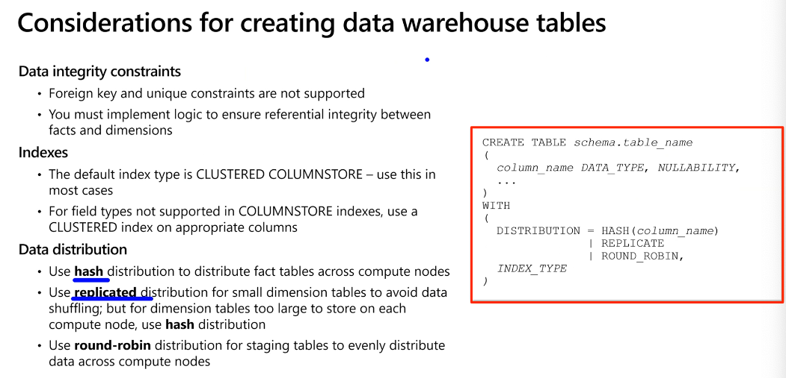
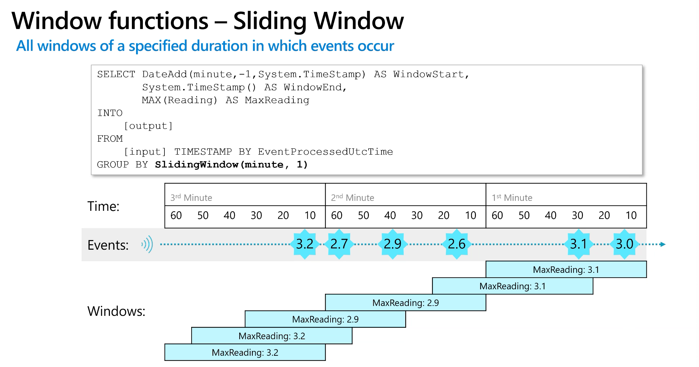
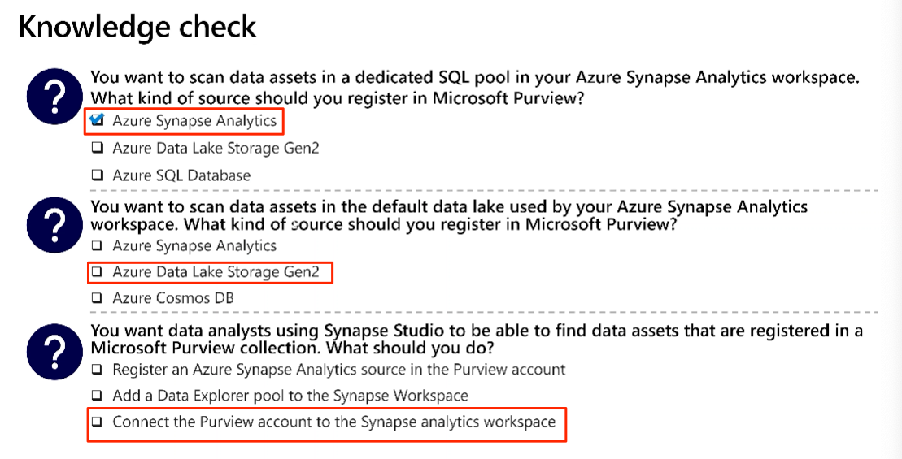
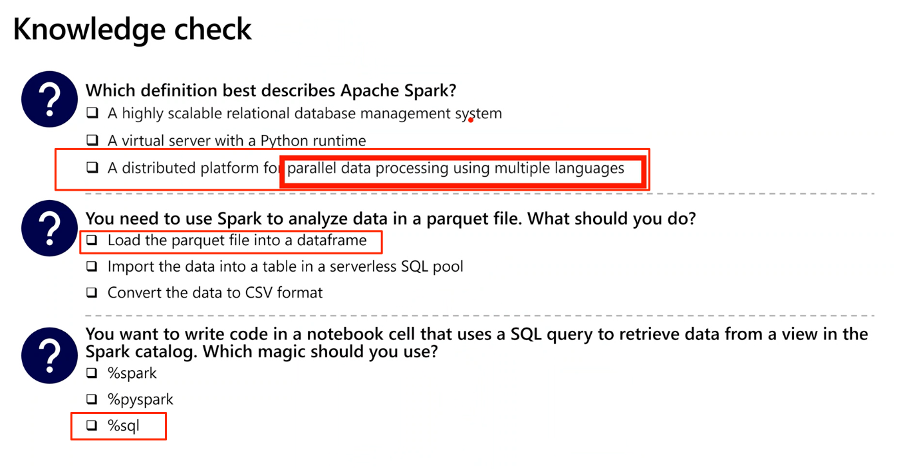
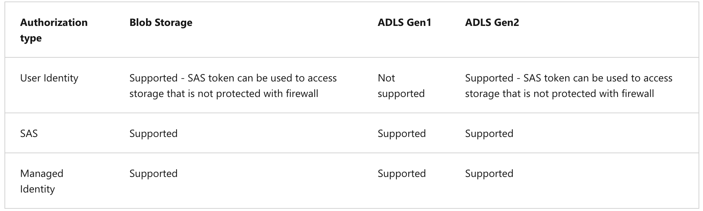
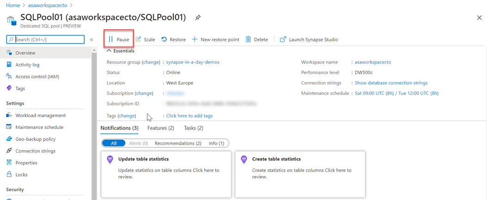
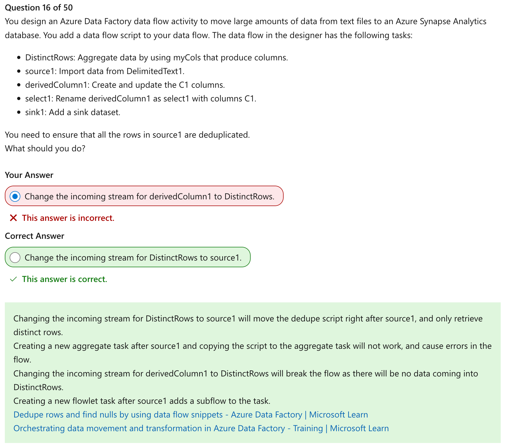

# Azure Data Engineer Training Notes

## What is Data Engineering?
Data engineers work with multiple types of data to perform a variety of data operations using a range of tools and scripting language

Types of Data:
	- Structured
	- Semi-structured
	- Unstructured

Data Operations:
	- Integration
	- Transformation
	- Consolidation

Languages:
	- SQL
	- Python
	- Others (R, Java, .NET, Scala)

Important data engineering concepts
	- Operational and analytical data
		- Operational: Transactional data used by applications
		- Analytical: Optimized for analysis and reporting
	- Streaming data
		- Perpetual, real-time data feeds
	- Data pipeline
		- Orchestrated activities to transfer and transform data. Used to implement extract, transform, and load (ETL) or extract, load, and transform (ELT) operations.
	- Data lake
		- Analytics data stored in files
		- Distributed storage for massive scalability
	- Data warehouse
		- Analytical data stored in a relational database
		- Typically modeled as a star schema to optimize summary analysis
		- Consolidates operational system
	- Apache Spark
		- Open-source engine for distributed data processing


### Understand Azure Data Lake Storage Gen2
	- Distributed cloud storage for data lakes
		- HDFS-compatibility - common file system for Hadoop, Spark, and others
		- Flexible security through folder and file level permissions
		- Built on Azure Storage:
			§ High performance and scalability
			§ Data redundancy through built-in replication
	- Blob container and File System terms are used interchangeably

What is Azure Synapse Analytics?
	- Cloud platform for data analytics
		- Large-scale data warehousing
		- Advanced analytics
		- Data exploration and discovery
		- Real time analytics
		- Data integration
		- Integrated analytics

Work with files in data lake
	- Use linked service to connect to data lake

Ingest and transform data with pipelines
	- Native pipeline functionality built on data factory

Query and manipulate data with SQL
	- SQL server based pools for scalable relational data processing:
		- Bult in serverless SQL pool for data explorations and analysis of files in the data lake
		- Custom dedicated SQL host pools…

Explore data with data explorer
	- High performance real time data analytics
	- Powerful, intuitive Kusto query language (KQL)


## Build data analytics solutions using Azure Synapse Analytics serverless SQL pools

SQL Pools in Azure 

Serverless SQL Pool
	- On-demand SQL query processing
	- Data stored as files in a data lake
	- Typical Use Cases:
		- Data exploration
		
Dedicated SQL Pools
	- Cloud-scale relational database
	- Data stored in relational tables
	- Typical Use Cases:
		- Relational Datawarehouse

Create external database objects


The CREATE EXTERNAL TABLE AS SELECT (CETAS) statement

Encapsulate data transformations in a stored procedure
Using a stored proc:
	- Reduces client to server network traffic
	- Provides a security boundary
	- Eases maintenance
	- Improved performance

Include a data transformation

Parquet destination is cleared when Delete folder activity runs
**Aside:**  Apache Parquet is an open source, column-oriented data file format designed for efficient data storage and retrieval.

Lake database concepts
	- Lake database schema:
		- Relational tables
		- Proven data modeling principles
		- Consistent naming conventions
	- Lake database storage:
		- Parquet or CSV in a data lake
		- Managed independently of database
		- Simplified data ingestion
	- Lake database compute:
		- Serverless SQL pool
		- Apache Spark pool

ACID Transactions
Row Version
Temporal Query

Parquet + magical files = delta tables


Database templates
	- Predefined relational schema based on common business scenarios
	- Use as a template for a new database or start with a blank schema and add pre-defined table definitions

Database designer
	- Visual tool for creating a database

www.aka.ms/mslearn-synapse-lakedb


## Exploring Spark capabilities

### Analyze data with Apache Spark in Azure Synapse Analytics

Hive Tables - Hive

Whatever runs in Spark runs in memory. Spark allows us to take the data that's in memory in a cluster and persist it. Hive is the persistent storage

Spark is In-Memory 

Meta datastore, will store table definitions/location -- Hive

Get to know Apache Spark
Distributed data processing framework
	- Code in multiple languages
	- Driver program uses SparkContext to coordinate processing across multiple executors on worker nodes
	- Executors run in parallel

Notebooks are made out of cells, written in github markdown format, there are also executable code cells

Work with data in multiple stores
	- Primary workspace data lake
	- Linked service storage
	- Dedicated or serverless SQL pool
	- Azure sql or sql server database
	- Azure cosmos db
	- Azure data explorer

### Analyze data with Spark
Quick note, can use PySpark or Scala to write code in your notebooks

```
%%pyspark
#Load data
df = spark.read.load("/data/products.csv", format="csv", header=True)

# Manipulate dataframe
Counts_df = df.select("ProductId", "Category") groupBy("Category").count()

# Display dataframe
display(counts_df)

Breaking down the code:
%%pyspark -- First line declares what language to interpret the code in

#Load data
df = spark.read.load("/data/products.csv", format="csv", header=True)

df = data frame, this reads in a CSV files with headers

# Manipulate dataframe
Counts_df = df.select("ProductId", "Category") groupBy("Category").count()

Creates a new dataframe called counts_df that projects only product id and category and groups by category

# Display dataframe
display(counts_df)
```

### Using SQL expressions in Spark

TempView - Only there during your spark session, when you close the notebook it goes away. If you want to persist it, you can save it into a table, a Hive Table

If the built in charts aren't what you need, you can use matplotlib, or any other python package that is used for creating charts

df.printschema() - prints only the schema of the data frame

Do Lab 5 for the above context.


### Modify and save data frames


## Transform data with Apache Spark in Azure Synapse Analytics

### Use Delta Lake in Azure Synapse Analytics

Module 4 - dedicated sql pool (data warehouse)

Design a data warehouse schema
	- Star schema
	- Snowflake schema

Dimension keys
	- Surrogate key
		- Uniquely identifies an instance of a dimension entity (i.e. row)
		- Usually a simple integer value
		- Must be unique in the dimension table
	- Alternate key
		- Identifies an entity in the operational source system
		- Often a business key (e.g. a product code or customer ID) or a native key (e.g. a datetime value in a time dimension)
		- Can be duplicated in the dimension table to represent the same entity at different points in time

Create a relational data warehouse in Azure Synapse Analytics
Create a dedicated SQL pool

Considerations for creating data warehouse tables



Why do we want to run Synapse on a virtual network? Or accessible through a virtual network?
You can define custom boundaries.

Exercise: Build a data pipeline in Azure Synapse Analytics
- Lab 10

There's no difference between ADF and Synapse pipelines

## Integration pipeline (subset of ADF services, integrated into Synapse offering)


## Work with hybrid transactional and analytical processing (HTAP)

### Plan hybrid transactional and analytical processing patterns
	1. A business application processes user input and stores data in a transactional database that is optimized for a mix of data reads and writes
	2. The application data is automatically replicated to an analytical store with low latency
	3. The analytics store supports data modeling, analytics, and reporting without impacting the transactional system

### Azure Synapse Link
	1. Azure Cosmos DB
	    - Transactional data stored in azure cosmos db container
	    - Data is synced to an analytical store in the container and queried via linked service in azure synapse analytics
	2. Azure SQL
	    - Transactional data stored in azure sql database or sql server
	    - Transactions are sync'd to a dedicated SQL pool in Azure synapse analytics
	3. Microsoft Dataverse
	    - Transactional data stored in dataverse tables
	    - Data is synced to data lake and queries via linked service in Azure Synapse Analytics


Create a linked service in Azure Synapse Analytics
Create an Azure cosmos db linked with one of the following types of authorization:
	- account key
	- Service principal
	- System assigned managed Identity
	- User managed identity


Implement Azure Synapse Link for SQL
	1. Transactional is data stored in the source database (Azure SQL Database or SQL Server 2022)
	    - Azure SQL Managed instance is NOT support by azure synapse link for SQL


cosmos.olap connector for cosmos db

## Stream Analytics

### Introduction to Data Streams
	1. Unbounded data source - records added perpetually
	2. Each data record represents an event at a specific time
	3. Data values can be aggregated over temporal (time-based) windows
	4. Results are typically used to support real-time visualization or ingested into an analytical store for historic analysis

Access near real-time data and read only snapshot data
Use Case: Think Uber, or Stocks, or Starbucks Online Ordering


### Event processing with Azure Stream Analytics
	1. Ingest data from an input
	    - Azure Event Hubs, Azure IoT Hub, or Azure Storage blob container
	2. Process the data by using a query
	    - Select, filter, and aggregate data values
	3. Write the results to an output
	    - Azure Data Lake Gen 2
	    - Azure SQL Database
	    - Azure Synapse Analytics
	    - Azure Functions
	    - Azure Event Hubs
	    - Microsoft Power BI
	    - Others


This query says to copy all of my input into my output

### Window functions - Tumbling Window
	- Contiguous series of fixed-size, non-overlapping temporal windows


### Window functions - Hopping Window
	- Overlapping windows at fixed intervals


### Window functions - Sliding Window
	- All windows of a specified duration in which events occur


### Window functions - Session Window
	- Variable length windows in which events occur within a specific timeout

**Use Case:** Ring Cam. Whenever an event occurs, the session renews, so if a session has started and the set duration is 60 seconds, and nothing happens for the first 30 seconds, but at 45 seconds an event occurs, the session is renewed and the 60 second countdown starts again. This happens until there are no events for 60 consecutive seconds, then the window closes.

### Snapshot Window
	- Windows containing concurrent events with the same timestamp


### Stream ingestion scenarios
	1. Relational data warehouse
	    - Use an Azure Synapse Analytics output
		    - Specify:
				- An alias for the output
				- The target synapse analytics dedicated SQL pool
				- The existing table into which the data is to be loaded
				- Authentication credentials
		    - Query ingested data using SQL in the dedicated SQL pool
	2. Data Lake


## What is Microsoft Purview?


The underlying technology is [Apache Atlas](https://atlas.apache.org/#/)


*Keep in mind that Purview does not move data, the pipelines move data.*





## Databricks


SSIS = script component


### Databricks Spark

When you perform an operation on a dataframe, the result is a new dataframe


# Azure Notes directly from Azure Online Training material

## Introduction to Data Engineering

	- Operational data is usually transactional data that is generated and stored by applications, often in a relational or non-relational database. 
	- Analytical data is data that has been optimized for analysis and reporting, often in a data warehouse.
	- One of the core responsibilities of a data engineer is to design, implement, and manage solutions that integrate operational and analytical data sources or extract operational data from multiple systems, transform it into appropriate structures for analytics, and load it into an analytical data store (usually referred to as ETL solutions).
	- Streaming data refers to perpetual sources of data that generate data values in real time, often relating to specific events.
		- Common sources of streaming data include IoT devices and social media feeds
	- Data pipelines are used to orchestrate activities that transfer and transform data.
		- Pipelines are the primary way in which data engineers implement repeatable extract, transform, and load (ETL) solutions that can be triggered based on a schedule or in response to events
	- A data lake is a repository of data that is stored in its natural format, usually as blobs or files.
		- Data lake stores are optimized for scaling to massive volumes (terabytes or petabytes) of data.
		- The data typically comes from multiple heterogeneous sources, and may be structured, semi-structured, or unstructured.
	- A data warehouse is a centralized repository of integrated data from one or more disparate sources.
		- Data warehouses store current and historical data in relational tables that are organized into a schema that optimizes performance for analytical queues.
	- Apache Spark is a parallel processing framework that takes advantage of in-memory processing and a distributed file storage.
		- It's a common open-source software (OSS) tool for big data scenarios.
		- Data engineers need to be proficient with Spark, using notebooks and other code artifacts to process data in a data lake and prepare for modeling and analysis.


*Typical enterprise data analytics solution built in Azure*

Core Azure technologies used to implement data engineering workloads are:
	1. Azure Synapse Analytics
	2. Azure Data Lake Storage Gen2
	3. Azure Stream Analytics
	4. Azure Data Factory
	5. Azure Databricks

### Understanding Azure Data Lake Storage Gen2
	1. Azure Data Lake Storage is a comprehensive, massively scalable, secure, and cost-effective data lake solution for high performance analytics built into Azure.
	2. Azure Data Lake Storage combines a file system with a storage platform to help you quickly identify insights into your data.
	3. Benefits
	    - Can be used for both real time and batch solutions
	    - Hadoop compatible access - can treat the data as if it's stored in a Hadoop Distributed File System.
	    - Can also use the parquet format, which is highly compressed and performs well across multiple platforms using an internal columnar storage.
	4. Security
	    - Supports ACLs (Access Control Lists)
	    - Supports POSIX (Portable Operating System Interface) permissions that don't inherit permissions of the parent directory.
	    - All data stored is encrypted at rest by using either Microsoft or customer-managed keys.
	5. Performance
	    - Azure Data Lake Storage organizes the stored data into a hierarchy of directories and subdirectories, much like a file system, for easier navigation. As a result, data processing requires less computational resources, reducing both the time and cost.
	6. Data redundancy
	    - LRS and GRS enabled
	    - Data Lake Storage takes advantage of the Azure Blob replication models that provide data redundancy in a single data center with locally redundant storage (LRS), or to a secondary region by using the Geo-redundant storage (GRS) option. This feature ensures that your data is always available and protected if catastrophe strikes.

### Azure Data Lake Store v. Azure Blob Storage
	1. Blob storage uses a flat namespace and organizes files into virtual folders.
	2. Azure Data Lake Storage Gen2 builds on blob storage and optimizes I/O of high volume data by using a hierarchical namespace that organizes blob data into directories and stores metadata about each directory and the files within it.
	3. To enable Azure Data Lake Storage Gen2, you need to select the "Hierarchical namespace" option under the Storage account.

### Understanding the stages for processing big data
	1. Ingest
	2. Store
	3. Prep and train
	    - Azure Synapse Analytics
	    - Azure Databricks
	    - Azure HDInsight
	    - Azure Machine Learning
	4. Model and serve
	    - Power BI
	    - Azure Synapse Analytics

### Using DLS Gen2 in data analytics workloads
	1. Big data processing and analytics
	2. Data warehousing
	    - Hybrid Data Warehouse and Data Lake solution is referred to as either a "data lakehouse" or "lake database" architecture.
	3. Real-time data analytics
	4. Data science and machine learning

## Azure Synapse Analytics
	1. What is Azure Synapse Analytics
	    - Descriptive analytics - What is happening in my business?
	    - Diagnostic analytics - Why is it happening?
	    - Predictive analytics - What is likely to happen in the future based on previous trends and patterns?
	    - Prescriptive analytics - Uses predictive analytics to make autonomous decision making in real time or near real time.
        - 
	2. How Azure Synapse Analytics works
	    - A Synapse Analytics workspace defines an instance of the Synapse Analytics service in which you can manage the services and data resources needed for your analytics solution.
	    - Synapse Studio - web based portal for Azure Synapse Analytics
	3. Ingest data from a data lake or data warehouse
	4. Can use SQL pools for data  storage
	5. Can process and analyze data with Apache Spark, Spark includes language support for Python, Scala, Java, SQL, and C#
	6. Can explore data with Data Explorer, using KQL, or Kusto Query Lanaguage
	7. Integrate with other Azure data services
	    - Azure Synapse Link enables real-time data synchronization between operational data in Azure CosmosDB Azure SQL Database, SQL Server, and Microsoft Power Platform Dataverse and analytical data storage that be queried in Azure Synapse Analytics
	    - Microsoft Power BI
	    - Microsoft Purview integration enables organizations to catalog data assets in Azure Synapse Analytics, and make it easier for data engineers to find data assets and track data lineage when implementing data pipelines that ingest data into Azure Synapse Analytics
	    - Azure Machine Learning integration enables data analysts and data scientists to integrate predictive model training and consumption into analytics solutions.

### When to use Azure Synapse Analytics
	1. Large Scale data warehousing
	2. Advanced analytics
	3. Data exploration and discovery
	4. Real time analytics
	5. Data integration
	6. Integrated analytics

### Understand Azure Synapse serverless SQL pool capabilities and use cases
	1. Serverless SQL pools in Azure Synapse Analytics
	    - Serverless SQL pool: on-demand SQL query processing, primarily used to work with data in a data lake
	    - Dedicated SQL pool: Enterprise-scale relational database instance used to host data warehouses in which data is stored in relational tables
	2. SQL pools provide a pay-per-query endpoint to query the data in your data lake.
	3. Benefits
	    - Familiar SQL syntax
	    - Connectivity with a wide range of BI tools
	    - Fast query performance
	    - High reliability and success rate
	    - Serverless
	    - No charge for reserved resources, only charged for the queries you run
	4. When to use serverless SQL pools
	    - Data exploration
	    - Data transformation
	    - Logical data warehouse

### Query Files using a serverless SQL pool
	1. Can use the a serverless SQL pool to query data files in various common file formats, including:
	    - Delimited text, such as CSV files
	    - JSON files
	    - Parquet files
	2.  ```
        OPENROWSET SQL function
	    SELECT TOP 100 *
		FROM OPENROWSET(
		    BULK 'https://mydatalake.blob.core.windows.net/data/files/*.csv',
		    FORMAT = 'csv') AS rows
        ```
	3. Querying delimited text files
	    - With and without a header row. 
	    - Comma and tab-delimited values. 
	    - Windows and Unix style line endings. 
	    - Non-quoted and quoted values, and escaping characters.
	4.  ```
        SELECT TOP 100 *
	    FROM OPENROWSET(
	    BULK 'https://mydatalake.blob.core.windows.net/data/files/*.csv',
	    FORMAT = 'csv',
	    PARSER_VERSION = '2.0',
	    FIRSTROW = 2) AS rows
	    - PARSER_VERSION is used to determine how the query interprets the text encoding used in the files.
		    - 1.0 allows you to parse more file encodings but has lower performance
		    - 2.0 allows you to have better performance but can parse fewer encodings
	    - FIRSTROW is used to skip rows
	    - FIELDTERMINATOR - the character used to separate field values in each row. For example, a tab-delimited file separates fields with a TAB (\t) character. The default field terminator is a comma (,).
	    - ROWTERMINATOR - the character used to signify the end of a row of data. For example, a standard Windows text file uses a combination of a carriage return (CR) and line feed (LF), which is indicated by the code \n; while UNIX-style text files use a single line feed character, which can be indicated using the code 0x0a.
	    - FIELDQUOTE - the character used to enclose quoted string values. For example, to ensure that the comma in the address field value 126 Main St, apt 2 isn't interpreted as a field delimiter, you might enclose the entire field value in quotation marks like this: "126 Main St, apt 2". The double-quote (") is the default field quote character.
	    - HEADER_ROW parameter (which is only available when using parser version 2.0) instructs the query engine to use the first row of data in each file as the column names.
	    - WITH - Can provide schema definition with a WITH clause, example:
		    - SELECT TOP 100 *
			FROM OPENROWSET(
			    BULK 'https://mydatalake.blob.core.windows.net/data/files/*.csv',
			    FORMAT = 'csv',
			    PARSER_VERSION = '2.0')
			WITH (
			    product_id INT,
			    product_name VARCHAR(20) COLLATE Latin1_General_100_BIN2_UTF8,
			    list_price DECIMAL(5,2)
			) AS rows
        ```
	5. Querying JSON
	    ```JSON_VALUE``` - extract individual values from a JSON, used in ```SELECT```
		    ```
                SELECT JSON_VALUE(doc, '$.product_name') AS product,
			           JSON_VALUE(doc, '$.list_price') AS price
			    FROM
			    OPENROWSET(
			        BULK 'https://mydatalake.blob.core.windows.net/data/files/*.json',
			        FORMAT = 'csv',
			        FIELDTERMINATOR ='0x0b',
			        FIELDQUOTE = '0x0b',
			        ROWTERMINATOR = '0x0b'
			    ) WITH (doc NVARCHAR(MAX)) as rows
            ```
	6. Querying Parquet files
	    - Parquet is a commonly used format for big data processing on distributed file storage.
	    - It's an efficient data format that is optimized for compression and analytical querying.
	    - In most cases, the schema of the data is embedded within the Parquet file, so you only need to specify the BULK parameter with a path to the file(s) you want to read, and a FORMAT parameter of parquet; like this:
		    ```
            SELECT TOP 100 *
			FROM OPENROWSET(
			    BULK 'https://mydatalake.blob.core.windows.net/data/files/*.*',
			    FORMAT = 'parquet') AS rows
            ```
### Create external database objects
	1. ``` 
        CREATE DATABASE - statement to create a database
	    - CREATE EXTERNAL DATA SOURCE files
		WITH (
		    LOCATION = 'https://mydatalake.blob.core.windows.net/data/files/'
		) 
        ```
	2. ```CREATE EXTERNAL DATA SOURCE``` - This create an external data source that references the same location frequently
	    ```SELECT *
		FROM
		    OPENROWSET(
		        BULK 'orders/*.csv',
		        DATA_SOURCE = 'files',
		        FORMAT = 'csv',
		        PARSER_VERSION = '2.0'
		    ) AS orders
		```
	3. ```CREATE EXTERNAL FILE FORMAT```
	    ```
        CREATE EXTERNAL FILE FORMAT CsvFormat
		    WITH (
		        FORMAT_TYPE = DELIMITEDTEXT,
		        FORMAT_OPTIONS(
		            FIELD_TERMINATOR = ',',
		            STRING_DELIMITER = '"'
		        )
		    );
		GO
        ```
	4. ```CREATE EXTERNAL TABLE``` - create external table that can be accessed with standard SQL SELECT statements
	    ```CREATE EXTERNAL TABLE dbo.products
		(
		    product_id INT,
		    product_name VARCHAR(20),
		    list_price DECIMAL(5,2)
		)
		WITH
		(
		    DATA_SOURCE = files,
		    LOCATION = 'products/*.csv',
		    FILE_FORMAT = CsvFormat
		);
		GO
		
		-- query the table
		SELECT * FROM dbo.products;
        ```
### Use Azure Synapse serverless SQL pools to transform data in a data lake
	1. Transform data files with the CREATE EXTERNAL TABLE AS SELECT statement
	    - You can use a CREATE EXTERNAL TABLE AS SELECT (CETAS) statement in a dedicated SQL pool or serverless SQL pool to persist the results of a query in an external table, which stores its data in a file in the data lake
        - 
	    - To use CETAS expressions, you must create the following types of object in a database for either a serverless or dedicated SQL pool. When using a serverless SQL pool, create these objects in a custom database (created using the CREATE DATABASE statement), not the built-in database.
	    - The CETAS statement creates a table with its data stored in files. You must specify the format of the files you want to create as an external file format. To create an external file format, use the CREATE EXTERNAL FILE FORMAT statement, as shown in this example:
		    ```
            CREATE EXTERNAL FILE FORMAT ParquetFormat
			WITH (
			        FORMAT_TYPE = PARQUET,
			        DATA_COMPRESSION = 'org.apache.hadoop.io.compress.SnappyCodec'
			    );
            ```
	2. An important point to understand is that you must use an external data source to specify the location where the transformed data for the external table is to be saved.
	3. You can store files for an external table in CSV or Parquet format (as well as other formats).
	4. Dropping external tables
	    ```DROP EXTERNAL TABLE table_name>;```
	    - External tables are a metadata abstraction over the files that contain the actual data. Dropping an external table does not delete the underlying files. If you want to recreate the external table in the same location you have to delete the files as well.

### Encapsulate data transformations in a stored procedure
	1. While you can run a CREATE EXTERNAL TABLE AS SELECT (CETAS) statement in a script whenever you need to transform data, it's good practice to encapsulate the transformation operation in stored procedure.
	2. Can use sprocs or stored procedures to drop external tables if you need to use the same table name when running a process, so check if it exists, delete, create new external table
	3. Reduced client to server network traffic
	4. Provides a security boundary
	5. Eases maintenance
	6. Improved performance - cached after first run
		
		
### Create a lake database in Azure Synapse Analytics
	1. Attributes of a data lake:
	    - In a data lake there is no fixed schema
	    - Data is stored in files, which may be structured, semi-structured, or unstructured.
	    - Can work with files without the constraints of a relational database system.
	2. Attributes of a lake database:
	    - A lake database provides a relational metadata layer over one or more files in a data lake.
	    - Can query using SQL
	    - The storage of data files is decoupled from the database schema, enabling more flexibility than a relational database system typically offers.
		    - Stored as Parquet or CSV files
	    - Compute
		    - Can use either Azure Synapse serverless SQL pool to run SQL
		    - Or an Azure Synapse Apache Spark pool to work with the tables using the Spark SQL API
	3. Database designer: The database designer in Azure Synapse Studio provides a drag and drop surface on which you can edit the tables in your database and the relationships between them.
	    - Can define the schema of your database by adding or removing tables
	    - Specifying the name and storage settings of each table
	    - Specifying the names, key usage, nullability, and data types for each column
	    - Defining relationships between key columns in tables
	4. Using a serverless SQL pool
	    - Can query a lake database using standard SQL
	    ```
        USE RetailDB;
		GO
		
		SELECT CustomerID, FirstName, LastName
		FROM Customer
		ORDER BY LastName;
        ```
	    - There is no need to use an ```OPENROWSET``` function or include any additional code to access the data from the underlying file storage. The serverless SQL pool handles the mapping to the files for you.
	5. Using an Apache Spark pool
	    - Insert record example
		    ```
            %%sql
			INSERT INTO `RetailDB`.`Customer` VALUES (123, 'John', 'Yang')
            ```
	    - Query table example
		    ```
            %%sql
			SELECT * FROM `RetailDB`.`Customer` WHERE CustomerID = 123
            ```

### Secure data and manage users in Azure Synapse serverless SQL pools
	1. Authentication
	    - SQL Authentication
		    - Requires username and password
	    - Azure Active Directory Authentication
		    - Uses Azure AD, multi-factor authentication can be enabled, this is the preferred authentication method.
	2. Authorization
	    - Refers to what a user can do within a serverless SQL pool database, determined by your user's database role and object-level permissions
	3. Authorization types
	    - Anonymous access
		    - Access publicly available files on Azure storage
	    - Shared access signature (SAS)
		    - Delegated access to resources within a storage account
	    - Managed identity
		    - yeah
	    - User identity
		    - a.k.a "pass-through", uses Azure AD, not supported for SQL user types
	    - Supported auth types for database users:
            - 
	    - Supported storage and auth types:
            - 
	4. Manage user permissions in Azure Synapse serverless SQL pools
	    - Access ACLs
		    - Controls access to an object. Files and directories both have access ACLs
	    - Default ACLs
		    - Are templates of ACLs associated with a directory that determine the access ACLs for any child items that are created under that directory. Files do not have default ACLs
	    - Both Access and Default ACLs have the same structure
	    - Permissions on a container object are Read, Write, and Execute:
            - 
	5. Roles necessary for serverless SQL pool users
    - | Access Type | Role |  Notes |
      | ----------- | ----------- | ----------- |
      | Read-only access | Storage Blob Data Reader  |   |
      | Read/Write access | Storage Blob Data Contributor | Required for CETAS |
	    - Can create database level permission or server level permission

## Get to know Apache Spark
	1. How Spark works
	    - Apache Spark applications run as independent sets of processes on a cluster, coordinated by the SparkContext object in your main program (called the driver program)
        - 
	    - The *SparkContext* is responsible for converting an application to a directed acyclic graph (DAG).
	2. Spark pools in Azure Synapse Analytics
	    - A cluster is implemented as a Spark pool which provides a runtime for Spark operations.
	    - Configuration options for the pool include:
		    - A name for the spark pool
		    - The size of the VM used for the nodes in the pool, including using accelerated GPU-enabled nodes
		    - The number of nodes in the pool, whether number is fixed or dynamic (auto-scale)
		    - Version of Spark Runtime

### Use Spark in Azure Synapse Analytics
	1. Running Spark code in notebooks
	    - Can run code in Python, Scala scripts, Java compiled as JAR, and others
	    - Spark is commonly used in two kinds of workload:
		    - Batch or stream processing jobs to ingest clean, and transform data - often running as part of an automated pipeline.
		    - Interactive analytics sessions to explore, analyze, and visualize data.
	2. The integrated notebook has a similar look and feel to Jupyter notebooks
        - 
	3. While notebooks are usually used interactively, they can be included in automated pipelines and run as an unattended script
	4. Notebooks consist of one or more cells each containing either code or markdown, code cells have the following features:
	    - Syntax highlighting and error support
	    - Code auto-completion
	    - Interactive data visualizations
	    - The ability to export results
	5. Accessing data from a Synapse Spark pool
	    - You can use Spark in Azure Synapse Analytics to work with data from various sources, including:
		    - A data lake based on the primary storage account for the Azure Synapse Analytics workspace
		    - A data lake based on storage defined as a linked service in the workspace
		    - A dedicated or serverless SQL pool in the workspace
		    - An Azure SQL or SQL Server database (using the Spark connector for SQL Server)
		    - An Azure Cosmos DB analytical database defined as a linked service and configured using Azure Synapse Link for Cosmos DB
		    - An Azure Data Explorer Kusto (KQL) database defined as a linked service in the workspace
		    - An external Hive metastore defined as a linked service in the workspace
	    - One of the most common uses of Spark is to work with data in a data lake, where you can read and write files in multiple commonly used formats, including delimited text, Parquet, Avro (works with timestamps and written in JSON and stuff), and others.

### Analyze data with Spark
	1. Exploring data with dataframes
	    - Default language for a new Azure Synapse Analytics Spark notebook is PySpark - a Spark-optimized version of Python
	    - Natively, Spark uses a data structure called a resilient distributed dataset (RDD)
	2. Loading data into a dataframe
	    ```
            %%pyspark --- Referred to as a magic, this sets the language for the cell
            df = spark.read.load('abfss://container@store.dfs.core.windows.net/products.csv',
                format='csv',
                header=True
            )
            display(df.limit(10))
        ```
		The above code reads in the first 10 lines of a CSV file with the headers
	3. Specifying a dataframe
	    - You can specify an explicit schema for the data:
		    ```
                productSchema = StructType([ 
                    StructField("ProductID", IntegerType()), 
                    StructField("ProductName", StringType()), 
                    StructField("Category", StringType()), 
                    StructField("ListPrice", FloatType()) 
                ])
            ```
		    - When you specify a schema, you do not need to set header to true
	4. Filtering and grouping dataframes
	    ```df.select()```
		    - Use this to select specific columns from an existing dataframe
		    - This will always return a new data frame
		    - Example: ```pricelist_df = df.select("ProductID", "ListPrice")```
				1. Shorter syntax: ```pricelist_df = df["ProductID", "ListPrice"]```
	    - Can chain methods
		    ```bikes_df = df.select("ProductName", "ListPrice").where((df["Category"]=="Mountain Bikes") | (df["Category"]=="Road Bikes"))```
	    ```groupBy()```
		    - Used to group and aggregate data
				1. ```counts_df = df.select("ProductID", "Category").groupBy("Category").count()```

### Using SQL Expressions in Spark
	1. Creating database objects in the Spark catalog
	    - Views
		    - A view is temporary, gets deleted at the end of current session.
				1. ```df.createOrReplaceTempView("products")```
	    ```spark.catalog.createTable```
		    - Creates an empty table
		    - Deleting a table deletes its underlying data
	    ```saveAsTable```
		    - Save dataframe as a table
	    ```spark.catalog.createExternalTable```
		    - Create an external table
				1. External tables define metadata in the catalog but get their underlying data from an external storage location, typically a folder in a data lake
	2. Using the Spark SQL API to query data
	    - Can use the Spark SQL API in code written in any language to query data in the catalog
		    ```
                bikes_df = spark.sql("SELECT ProductID, ProductName, ListPrice \
                      FROM products \
                      WHERE Category IN ('Mountain Bikes', 'Road Bikes')")
            ```
	3. Using SQL code
	    ```%%sql```
		    - Use the above magic to run SQL in a notebook

### Visualize data with Spark
	1. Built-in notebook charts
	    - The built-in charting functionality in notebooks is useful when you're working with results of a query that don't include any existing groupings or aggregations, and you want to quickly summarize the data visually.
	2. Using graphic packages in code
	    - There are many graphics packages that you can use to create data visualizations in code
	    - Many python libraries are built on the base of **Matplotlib**


### Work with Data Warehouses using Azure Synapse Analytics
	1. Scale compute resources in Azure Synapse Analytics
        - 
	    - ```
            ALTER DATABASE mySampleDataWarehouse
            MODIFY (SERVICE_OBJECTIVE = 'DW300c');
        ```
	2. Scaling Apache Spark pools in Azure Synapse Analytics
	    - **Autoscale** - Automatically scales the number of nodes in a cluster instance up and down
	    - On **Basics** tab, select **Enable autoscale** checkbox, to enable this feature
		    - Enter min number of nodes and Max number of nodes
		    - Min cannot be fewer than 3
	3. Pause compute in Azure Synapse Analytics
	    - Can pause batch jobs based on the schedule of data loads into the system
        - 

### Manage workloads in Azure Synapse Analytics
	1. Workload classification
	    - Workload management classification allows workload policies to be applied to requests through assigning resource classes and importance.
	2. Workload importance
	    - Influences the order in which a request gets access to resources
	3. Workload isolation
	    - Reserves resources for a workload group

### Use Azure Advisor to review recommendations
	1. Azure Advisor provides you with personalized messages that provide information on best practices to optimize the setup of your Azure services.
	2. Can help you improve the cost effectiveness, performance, Reliability (formerly called High availability), and security of your Azure resources.
	3. Advisor has a dashboard that provides recommendations in the following areas:
	    - Cost
	    - Security
	    - Reliability
	    - Operational excellence
	    - Performance
	4. All queries executed on SQL pool are logged to ```sys.dm_pdw_exec_requests```.
	    - ```request_id``` uniquely identifies each query and is the primary key for this DMV
		    - Prefixed with QID, query ID
	    - Can assign labels to queries
		    - Query with Label ```SELECT * FROM sys.tables OPTION (LABEL = 'My Query') ```

Analyze and optimize data warehouse storage in Azure Synapse Analytics
	1. Understand skewed data and space usage
	    - Data skew is an over-represented value
	    - A quick way to check for data skew is to use ```DBCC PDW_SHOWSPACEUSED```
		    - Find data skew for a distributed table ```DBCC PDW_SHOWSPACEUSED('dbo.FactInternetSales');```
	    - **DMV** = System Dynamic Management View
        
        | Table Name | Description |
        | ----------- | ----------- |
		| ```sys.schemas``` | All schemas in the database |
        | ```sys.tables``` | All the tables in the database |
        | ```sys.indexes``` | All indexes in the database |
        | ```sys.columns``` | All columns in the database |
        | ```sys.pdw_table_mappings``` | Maps each table to local tables on physical nodes and distributions. |
        | ```sys.pdw_nodes_tables``` | Contains information on each local table in each distribution. |
        | ```sys.pdw_table_distribution_properties``` | Holds distribution information for tables (the type of distribution tables have). |
        | ```sys.pdw_column_distribution_properties``` | Holds distribution information for columns. Filtered to include only columns used to distribute their parent tables (distribution_ordinal = 1). |
        | ```sys.pdw_distributions``` | Holds information about the distributions from the SQL pool. |
        | ```sys.dm_pdw_nodes``` | Holds information about the nodes from the SQL pool. Filtered to include only compute nodes (type = COMPUTE). |
        | ```sys.dm_pdw_nodes_db_partition_stats``` | Returns page and row-count information for every partition in the current database. |
	2. Understand column store storage details
	    - The DMV ```sys.dm_pdw_nodes_db_column_store_row_group_physical_stats``` exposes useful information such as number of rows in rowgroups and the reason for trimming, if there was trimming.
	3. Understanding the impact of wrong choices for column data types
	    - Use the smallest data type that works for your data, this helps to shorten row length which improves overall performance
		    - Avoid defining character columns with a large default length.
		    - Avoid using ```NVARCHAR``` when you only need ```VARCHAR``` to support non-unicode data.
		    - When possible, use ```NVARCHAR(4000)``` or ```VARCHAR(8000)``` instead of ```NVARCHAR(MAX)``` or ```VARCHAR(MAX)```.
		    - Focus on using the minimal data type as possible. 
		    - Use DATETIME instead of storing date values in different formats such as string or numeric values.
				1. When it comes to querying your data based on date, an additional conversion will put a massive overhead on your queries.
		    - If you only need to store a date and not the time make sure you use ```DATE``` instead of ```DATETIME```.
				1. There is a 4 bytes difference between the two.
	    - Workarounds for unsupported data types

            | Unsupported data type | Workaround |
            | ----------- | ----------- |
            | geometry | varbinary |
            | geography | varbinary |
            | hierarchyid | nvarchar |
            | image | varbinary |
            | text | varchar |
            | ntext | nvarchar |
            | sql_variant | Split column into several strongly typed columns. |
            | table | Convert to temporary tables. |
            | timestamp | Rework code to use datetime2 and the CURRENT_TIMESTAMP function. Only constants are supported as defaults, so current_timestamp can't be defined as a default constraint. If you need to migrate row version values from a timestamp typed column, use BINARY(8) or VARBINARY(8) for NOT NULL or NULL row version values. |
            | xml | varchar |
            | user-defined type | Convert back to the native data type when possible. |
            | default values | Default values support literals and constants only. |
	
	4. Describe the impact of materialized views
	    - Materialized views in the Azure Synapse SQL pool provide a low maintenance method for complex analytics queries to quickly perform without any query change.
	    - SQL pool in Azure Synapse supports standard and materialized views
	    - Both are virtual tables created with SELECT expressions and presented to queries as logical tables

            | Comparison | View | Materialized view |
            | ----------- | ----------- | ----------- |
            | View definition | Stored in SQL pool. | Stored in SQL pool. |
            | View content | Generated each time when the view is used. | Pre-processed and stored in SQL pool during view creation. Updated as data is added to the underlying tables. |
            | Data refresh | Always updated | Always updated |
            | Speed to retrieve view data from complex queries | Slow | Fast |
            | Extra storage | No | Yes |
            | Syntax | ```CREATE VIEW``` | ```CREATE MATERIALIZED VIEW AS SELECT``` |

	    - A materialized view pre-computes, stores, and maintains its data in SQL pool just like a table.
	    - Users can run ```EXPLAIN WITH_RECOMMENDATIONS your_SQL_statement``` to get the materialized views recommended by the query optimizer
	5. Rules for minimally logged operations
	    - Unlike fully logged operations, which use the transaction log to keep track of every row change, minimally logged operations keep track of extent allocations and meta-data changes only.
	    - The following operations are capable of being minimally logged: 
		    ```CREATE TABLE AS SELECT (CTAS)```
		    ```INSERT SELECT```
		    ```CREATE INDEX``` 
		    ```ALTER INDEX REBUILD``` 
		    ```DROP INDEX``` 
		    ```TRUNCATE TABLE``` 
		    ```DROP TABLE``` 
		    ```ALTER TABLE SWITCH PARTITION```
	    - Minimal logging with bulk load
            | Primary Index	| Load Scenario | Logging Mode |
            | ----------- | ----------- | ----------- |
		    | Heap | Any | Minimal |
            | Clustered Index | Empty target table | Minimal |	
            | Clustered Index | Loaded rows do not overlap with existing pages in target | Minimal |	
            | Clustered Index | Loaded rows overlap with existing pages in target | Full |	
            | Clustered Columnstore Index | Batch size >= 102,400 per partition aligned distribution | Minimal |	
            | Clustered Columnstore Index | Index	Batch size  102,400 per partition aligned distribution | Full |	
	    - Any writes to update secondary or non-clustered indexes will always be fully logged operations

### Secure a data warehouse in Azure Synapse Analytics
	1. Understand network security options for Azure Synapse Analytics
	    - Firewall rules
		    - Firewall rules enable you to define the type of traffic that is allowed or denied access to an Azure Synapse workspace using the originating IP address of the client that is trying to access the Azure Synapse Workspace.
		    - IP firewall rules configured at the workspace level apply to all public endpoints of the workspace including dedicated SQL pools, serverless SQL pool, and the development endpoint.
	    - Virtual networks (Vnet)
		    - VNet enables many types of Azure resources, such as Azure Synapse Analytics, to securely communicate with other virtual networks, the internet, and on-premises networks.
	    - Private endpoints
		    - Private link enables you to access Azure services (such as Azure Storage and Azure Cosmos DB) and Azure hosted customer/partner services from your Azure Virtual Network securely.
		    - When you use a private link, traffic between your Virtual Network and workspace traverses entirely over the Microsoft backbone network. Private Link protects against data exfiltration risks. You establish a private link to a resource by creating a private endpoint.
		    - Private endpoints are mapped to a specific resource in Azure and not the entire service. 
	2. Configure Conditional Access
	    - Conditional Access is a feature that enables you to define the conditions under which a user can connect to your Azure subscription and access services. Conditional Access provides an additional layer of security that can be used in combination with authentication to strengthen the security access to your network.
	    - Conditional Access policies use signals as a basis to determine if Conditional Access should first be applied. Common signals include: 
		    - User or group membership names 
		    - IP address information 
		    - Device platforms or type 
		    - Application access requests 
		    - Real-time and calculated risk detection 
		    - Microsoft Cloud App Security (MCAS)
		    - Perform multifactor authentication
		    - Use a specific device to connect
	3. Configure authentication
	    - What needs to be authenticated?
		    - Users and services
	    - Types of security
		    - Azure Active Directory
		    - Managed Identities
		    - SQL Authentication
				1. For users not part of Azure AD
			    2. A user is created in the instance of a dedicated SQL pool
		    - Multifactor authentication
		    - Keys
				1. If you are unable to use a managed identity to access resources such as Azure Data Lake then you can use storage account keys and shared access signatures.
		    - Shared access signatures (SAS)
				1. A SAS is a string that contains a security token that can be attached to a URI
			    2. Types of SAS
				    - Service-level SAS allows access to specific resources in a storage account
				    - Account-level SAS allows access to anything that a service-level SAS can allow, plus additional resources and abilities
	4. Manage authorization through column and row level security
	    - Column level security in Azure Synapse Analytics
		    - Allows you to restrict column access in order to protect sensitive data
		    - The way to implement column level security is by using the GRANT T-SQL statement. Using this statement, SQL and Azure AD support the authentication
	    - Row level security in Azure Synapse Analytics
		    - Row-level security (RLS). Just like column-level security, can help and enable your design and coding of your application security
		    - The way to implement RLS is by using the ```CREATE SECURITY POLICY[!INCLUDEtsql]``` statement.
	5. Manage sensitive data with Dynamic Data Masking
	    - Dynamic Data Masking ensures limited data exposure to non-privileged users, such that they cannot see the data that is being masked. 
	    - Dynamic Data Masking is a policy-based security feature. It will hide the sensitive data in a result set of a query that runs over designated database fields.
	    - For Azure Synapse Analytics, the way to set up a Dynamic Data Masking policy is using PowerShell or the REST API.
	    - The configuration of the Dynamic Data Masking policy can be done by the Azure SQL Database admin, server admin, or SQL Security Manager roles.
	6. Implement encryption in Azure Synapse Analytics
	    - Transparent data encryption (TDE) is an encryption mechanism to help you protect Azure Synapse Analytics. 
	    - TDE encrypts data at rest.
	    - TDE performs real-time encryption as well as decryption of the database, associated backups, and transaction log files at rest without you having to make changes to the application.
	    - TDE encrypts the entire database storage using a symmetric key called a Database Encryption Key (DEK)
	    - By using Azure Key Vault integration for TDE, you have control over the key management tasks such as key rotations, key backups, and key permissions.
	
	
## Transfer and transform data with Azure Synapse Analytics pipelines

### Build a data pipeline in Azure Synapse Analytics
	1. Understand pipelines in Azure Synapse Analytics
	    - Pipelines in Azure Synapse Analytics encapsulate a sequence of activities that perform data movement and processing tasks.
	2. Core pipeline concepts
        - 
	    - Activities are executable tasks in a pipeline.
	    - Integration runtime provides the execution context and is used to initiate and coordinate the activities in the pipeline.
	    - Linked services enable secure connections to external services used by your pipeline.
	    - Datasets define the data that is consumed and produced by activities in a pipeline.
	3. Define data flows
	    - A Data Flow is a commonly used activity type to define data flow and transformation. Data flows consist of:
		    - Sources - The input data to be transferred
		    - Transformations - Various operations that you can apply to data as it streams through the data flow
		    - Sinks - Targets into which the data will be loaded

### Use Spark Notebooks in an Azure Synapse Pipeline
	1. Understand Synapse Notebooks and Pipelines
	    - Azure Synapse Pipelines enable you to create, run, and manage data integration and data flow activities.
	2. Use a Synapse notebook activity in a pipeline
	    - Notebook activity specific settings include:
		    - Notebook: The notebook you want to run. You can select an existing notebook in your Azure Synapse Analytics workspace, or create a new one.
		    - Spark pool: The Apache Spark pool on which the notebook should be run.
		    - Executor size: The node size for the worker nodes in the pool, which determines the number of processor cores and the amount of memory allocated to worker nodes.
		    - Dynamically allocate executors: Configures Spark dynamic allocation, enabling the pool to automatically scale up and down to support the workload.
		    - Min executors: The minimum number of executors to be allocated
		    - Max executors: The maximum number of executors to be allocated
		    - Driver size: The node size for the drive node
	3. Use parameters in a notebook
            - 

### Work with Hybrid Transactional and Analytics Processing Solutions using Azure Synapse Analytics
	1. Plan hybrid transactional and analytical processing using Azure Synapse Analytics
	    - Understand hybrid transactional and analytical processing patterns
		    - OLTP systems are optimized for dealing with discrete system or user requests immediately and responding quickly as possible
		    - OLAP systems are optimized for the analytical processing, ingesting, synthesizing, and managing large sets of historical data
		    - HTAP - Hybrid Transactional / Analytical Processing (HTAP)
				1. HTAP enables business to run advanced analytics in near-real-time on data stored and processed by OLTP systems
                2. 
	    - Describe Azure Synapse Link
		    - Azure Synapse Link for Cosmos DB
				1. Azure synapse link creates a tight seamless integration between Azure Cosmos DB and Azure Synapse Analytics
                2. 
	    - Azure Synapse Link for Dataverse
		    - Azure Synapse Link for Dataverse enables HTAP integration by replicating table data to Azure Data Lake storage, where it can be accessed by runtimes in Azure Synapse Analytics - either directly from the data lake or through a Lake Database defined in a serverless SQL pool.
			
				1. In the diagram above, the following key features of the Azure Synapse Link for Dataverse architecture are illustrated: 
				    - Business applications store data in Microsoft Dataverse tables. 
				    - Azure Synapse Link for SQL replicates the table data to an Azure Data Lake Gen2 storage account associated with an Azure Synapse workspace. 
				    - The data in the data lake can be used to define tables in a lake database and queried using a serverless SQL pool, or read directly from storage using SQL or Spark.
	2. Implement Azure Synapse Link with Azure Cosmos DB
	    - To use Azure Synapse Link in Azure Cosmos DB you have to first enable it in the Cosmos DB account
	    - Supported types:
		    - Azure Cosmos DB for NoSQL
		    - Azure Cosmos DB for MongoDB
		    - Azure Cosmos DB for Apache Gremlin
	    - Can use CLI and Powershell to Enable the link
	    - After enabling Azure Synapse Link for an account, you can't disable it.
	    - After a schema type has been assigned, you can't change it.
	    - Analytics store schema types
		    - **Well-defined:** The default schema type for an Azure Cosmos DB for NoSQL account
		    - **Full fidelity:** The default (and only supported) schema type for an Azure Cosmos DB for MongoDB account.
	    - Analytical store support cannot be deleted without deleting the container.
		h. Query Cosmos DB data with Spark
		    - Loading Azure Cosmos DB analytics data into a dataframe
				1. ```
                    df = spark.read
				     .format("cosmos.olap")\
				     .option("spark.synapse.linkedService", "my_linked_service")\
				     .option("spark.cosmos.container", "my-container")\
				     .load()
				
				    display(df.limit(10))
                ```
		    - Writing a dataframe to a Cosmos DB container
				1. ```
                    mydf.write.format("cosmos.oltp")\
				    .option("spark.synapse.linkedService", "my_linked_service")\
				    .option("spark.cosmos.container", "my-container")\
				    .mode('append')\
				    .save()
                    ```
		    - Use the ```OPENROWSET``` function when writing SQL code in a serverless SQL pool to query an analytical store in Azure Cosmos DB
	3. Implement Azure Synapse Link for SQL
	    - Azure Synapse Link supports the following source databases:
		    - Azure SQL Database
		    - Microsoft SQL Server 2022
	    - Implementing Azure Synapse Link for SQL Server 2022
		    - Create landing zone storage
		    - Create a master key in the SQL Server database
		    - Create a dedicated SQL pool in Azure Synapse Analytics
		    - Create a linked service for the SQL Server source database
		    - Create a linked service for your Data Lake Storage Gen2 account
		    - Create a link connection for Azure Synapse Link

### Implement a Data Streaming Solution with Azure Stream Analytics
	1. Getting started with Azure Stream Analytics
	    - Azure Stream Analytics provides a cloud-based stream processing engine that you can use to filter, aggregate, and otherwise process a real-time stream of data from various sources.
	    - A data stream consists of a perpetual series of data, typically related to specific point-in-time events.
	    - Characteristics of stream processing solutions
            - 
		    - The source data stream is unbounded - data is added to the stream perpetually
		    - Each data record in the stream includes temporal (time-based) data indicating when the event to which the record relates occurred (or was recorded)
		    - Aggregation of streaming data is performed over temporal windows
		    - The results of streaming data processing can be used to support real-time (or near real-time) automation or visualization, or persisted in an analytical store to be combined with other data for historical analysis.
	    - Understand event processing
		    - Ingest data from an input, such as Azure event hub, IoT Hub, or blob container
		    - Process the data by using a query to select, project, and aggregate data values
		    - Write the results to an output, such as Azure Data Lake Gen 2, Azure SQL Database, Azure Synapse Analytics, Azure Functions, Azure event hub, Microsoft Power BI, or others
            - 
	    - Once started, a Stream Analytics query will run perpetually, processing new data as it arrives in the input and storing results in the output.
	    - Inputs are generally used to reference a source of streaming data, which is processed as new event records are added.
	    - Outputs are destinations to which the results of stream processing are sent.
		- Queries - The stream processing logic is encapsulated in a query. 
		    - Queries are defined using SQL statements that SELECT data fields FROM one or more inputs, filter or aggregate the data, and write the results INTO an output.
		    - Example: 
			```
                SELECT observation_time, weather_station, temperature
                INTO cold-temps
                FROM weather-events TIMESTAMP BY observation_time
                WHERE temperature  0
            ```
	    - A field named EventProcessedUtcTime is automatically created to define the time when the event is processed by your Azure Stream Analytics query.
		- Understanding window functions
		    - **Tumbling** window functions segment a data stream into a contiguous series of fixed-size, non-overlapping time segments and operate against them. Events can't belong to more than one tumbling window.
		    - **Hopping** window functions model scheduled overlapping windows, jumping forward in time by a fixed period.
		    - **Sliding** windows generate events for points in time when the content of the window actually changes. 
		    - **Session** window functions cluster together events that arrive at similar times, filtering out periods of time where there's no data.
		    - **Snapshot** windows groups events by identical timestamp values.
	2. Ingest streaming data using Azure Stream Analytics and Azure Synapse Analytics
	    - Stream ingestion scenarios
		    - Data warehouses in Azure Synapse Analytics
                1. 
		    - Data lakes in Azure Synapse Analytics
                1. 
	    - Define a query to select, filter, and aggregate data
		    - Selecting input fields
				1. ```
                    SELECT
                        EventEnqueuedUtcTime AS ReadingTime,
                        SensorID,
                        ReadingValue
                    INTO
                        [synapse-output]
                    FROM
                        [streaming-input] TIMESTAMP BY EventEnqueuedUtcTime
                ```
		    - Filtering event data
				1. ```
                    SELECT
                        EventEnqueuedUtcTime AS ReadingTime,
                        SensorID,
                        ReadingValue
                    INTO
                        [synapse-output]
                    FROM
                        [streaming-input] TIMESTAMP BY EventEnqueuedUtcTime
                    WHERE ReadingValue  0
                ```
		    - Aggregating events over temporal windows
				1. ```
                    SELECT
                        DateAdd(second, -60, System.TimeStamp) AS StartTime,
                        System.TimeStamp AS EndTime,
                        SensorID,
                        MAX(ReadingValue) AS MaxReading
                    INTO
                        [synapse-output]
                    FROM
                        [streaming-input] TIMESTAMP BY EventEnqueuedUtcTime
                    GROUP BY SensorID, TumblingWindow(second, 60)
                    HAVING COUNT(*) > 1
                ```
	3. Visualize real-time data with Azure Stream Analytics and Power BI
        - 


## Govern data across an enterprise
	1. Introduction to Microsoft Purview
	    - Microsoft Purview is a unified data-governance service that helps you manage and govern your on-premises, multicloud, and SaaS data.
	    - You can easily create a holistic, up to date map of your data landscape with automated data discovery, sensitive data classification, and end to end data lineage.
	    - You can also empower data consumers to find valuable trustworthy data
	2. Main elements of Microsoft purview
	    - Microsoft Purview Data Map
	    - Purview Data Catalog
	    - Purview Data Estate Insights
		    - Asset insights
		    - Scan insights
		    - Classification insights
		    - Sensitivity insights
		    - File extension insights
	3. How Microsoft Purview Works
	    - Loading data in the Data Map
		    - **Sourcing Data:** Microsoft Purview supports an array of data sources that span on-premises, multicloud, and SaaS options. You'll register the various data sources so Microsoft Purview is aware of them.
		    - **Mapping data:** A data map is a foundational platform for Microsoft Purview.
				1. Data Map = Data assets + Lineage + Classifications + Business Context
		    - **Scanning Data:** Once you've registered your data sources, you'll need to run a scan to be able to access the metadata and browse the asset information.
				1. You can set what to scan, even limit it to what files types to scan
		    - **Classification:** Metadata is used to help describe the data that is being scanned and made available in the catalog. 
				1. **Government:** Covers attributes such as government identity cards, driver license numbers, passport numbers, and so on. 
			    2. **Financial:** Covers attributes such as bank account numbers or credit card numbers. 
			    3. **Personal:** Personal information such as a person's age, date of birth, email address, phone number, and so on. 
			    4. **Security:** Attributes like passwords that may be stored. 
			    5. **Miscellaneous:** Attributes not covered in the other categories.
		    - **Browse and search:** Microsoft Purview allows you to search information from Data Map using Purview Catalog. You can perform text-based search and incorporate business context into the search as well.
		    - **Data lineage:** The concept of data lineage focuses on the lifecycle of data. The lifecycle concerns itself with the various stages data may go through. Data is sourced, moved, and stored throughout the lifecycle. Data may also undergo transformations in the extract load transform/extract transform load (ELT/ETL) operations. Data lineage can offer insights into the data lifecycle by looking at the data pipeline. You can use the lineage to identify the root cause of issues, perform data quality analysis, and verify compliance.
                1. 
	4. When to use Microsoft Purview
	    - Data Discovery - Find data sources
	    - Data Governance

### Discover trusted data using Microsoft Purview
	1. Can use Purview with Power BI
	2. Register and scan data
	    - Registration and scanning of data enables discoverability of data across an estate
	3. Collections
	    - The data map is the core of Microsoft Purview, which keeps an up to date map of assets and their metadata across your data estate
	    - They also provide a security boundary for your metadata in the data map


## Data engineering with Azure Databricks
	### Explore Azure Databricks
	    - Creating an Azure Databricks workspace:
		    - Using the Azure portal user interface. 
		    - Using an Azure Resource Manager (ARM) or Bicep template. 
		    - Using the New-AzDatabricksWorkspace Azure PowerShell cmdlet 
		    - Using the az databricks workspace create Azure command line interface (CLI) command.
	    - Identify Azure Databricks workloads
		    - Data Science and Engineering
		    - Machine Learning
		    - SQL
	    - Key concepts
		    - **Apache Spark clusters** - Spark is a distributed data processing solution that makes use of clusters to scale processing across multiple compute nodes. Each Spark cluster has a driver node to coordinate processing jobs, and one or more worker nodes on which the processing occurs. This distributed model enables each node to operate on a subset of the job in parallel; reducing the overall time for the job to complete. To learn more about clusters in Azure Databricks, see Clusters in the Azure Databricks documentation. 
		    - **Databricks File System (DBFS)** - While each cluster node has its own local file system (on which operating system and other node-specific files are stored), the nodes in a cluster have access to a shared, distributed file system in which they can access and operate on data files. The Databricks File System (DBFS) enables you to mount cloud storage and use it to work with and persist file-based data. To learn more about DBFS, see Databricks File System (DBFS) in the Azure Databricks documentation. 
		    - **Notebooks** - One of the most common ways for data analysts, data scientists, data engineers, and developers to work with Spark is to write code in notebooks. Notebooks provide an interactive environment in which you can combine text and graphics in Markdown format with cells containing code that you run interactively in the notebook session. To learn more about notebooks, see Notebooks in the Azure Databricks documentation. 
		    - **Hive metastore** - Hive is an open source technology used to define a relational abstraction layer of tables over file-based data. The tables can then be queried using SQL syntax. The table definitions and details of the file system locations on which they're based is stored in the metastore for a Spark cluster. A Hive metastore is created for each cluster when it's created, but you can configure a cluster to use an existing external metastore if necessary - see Metastores in the Azure Databricks documentation for more details. 
		    - **Delta Lake** - Delta Lake builds on the relational table schema abstraction over files in the data lake to add support for SQL semantics commonly found in relational database systems. Capabilities provided by Delta Lake include transaction logging, data type constraints, and the ability to incorporate streaming data into a relational table. To learn more about Delta Lake, see Delta Lake Guide in the Azure Databricks documentation. 
		    - **SQL Warehouses** - SQL Warehouses are relational compute resources with endpoints that enable client applications to connect to an Azure Databricks workspace and use SQL to work with data in tables. The results of SQL queries can be used to create data visualizations and dashboards to support business analytics and decision making. SQL Warehouses are only available in premium tier Azure Databricks workspaces. To learn more about SQL Warehouses, see SQL Warehouses in the Azure Databricks documentation.
	2. Use Apache Spark in Azure Databricks
	3. Use Delta Lake in Azure Databricks
	    - Create a delta lake table from a dataframe
		    ```# Load a file into a dataframe
			df = spark.read.load('/data/mydata.csv', format='csv', header=True)
			
			# Save the dataframe as a delta table
			delta_table_path = "/delta/mydata"
			df.write.format("delta").save(delta_table_path)
            ```
	    - Time travel - a feature that enables you to query previous versions of a table
		    ```df = spark.read.format("delta").option("versionAsOf", 0).load(delta_table_path)```
	    - Can also use time travel to query for a specific timestamp
		    ```df = spark.read.format("delta").option("timestampAsOf", '2022-01-01').load(delta_table_path)```
	    - Can overwrite  or replace an existing Delta Lake table with a dataframe by using the overwrite mode
		    ```new_df.write.format("delta").mode("overwrite").save(delta_table_path)```
	    - Can also append to an existing Delta Table from a dataframe using append
		    ```new_rows_df.write.format("delta").mode("append").save(delta_table_path)```
	    - External vs managed tables
		    - A managed table is defined without a specified location, and the data files are stored within the storage used by the metastore. Dropping the table not only removes its metadata from the catalog, but also deletes the folder in which its data files are stored. 
		    - An external table is defined for a custom file location, where the data for the table is stored. The metadata for the table is defined in the Spark catalog. Dropping the table deletes the metadata from the catalog, but doesn't affect the data files.
	    - Use Delta Lake for streaming data
		    - Spark structured streaming
				1. An API that is based on a boundless dataframe in which streaming data is captured for processing.
		    - Streaming with Delta Lake tables
		h. Delta Lake provides a relational storage layer in which you can create tables based on Parquet files in a data lake.
	    - Storing a dataframe in DELTA format creates parquet files for the data and the transaction log metadata necessary for Delta Lake tables.
	4. Use SQL Warehouses in Azure Databricks
	    - When you create a premium-tier Azure Databricks workspace, it includes a default SQL Warehouse named Starter Warehouse
	    - All SQL Warehouses contain a default database named default. 
	    - When creating a database in the SQL Warehouse, use ```CREATE SCHEMA```
		    - ```CREATE SCHEMA``` and ```CREATE TABLE``` both work, but ```CREATE SCHEMA``` is preferred
	5. Run Azure Databricks Notebooks with Azure Data Factory
        - 
	    - ADF supports a **Notebook** activity that can be used to automate the unattended execution of a notebook in an Azure Databricks Workspace
	    - Can generate access tokens to grant access to Databricks as an alternative to typical user/password credentials
	    - Use a linked service to connect ADF to Databricks
	    - Using parameters in a notebook
		    - To define and use parameters in a notebook, use the **dbutils.widgets** library in your notebook code.
				1. ```dbutils.widgets.text("folder", "data")``` -- defines a folder
			    2. ```folder = dbutils.widgets.get("folder")``` -- retrieve a parameter value
		    - Passing output values - In addition to using parameters that can be passed in to a notebook, you can pass values out to the calling application by using the notebook.exit function, as shown here:
				1. ```
                    path = "dbfs:/{0}/products.csv".format(folder)
                    dbutils.notebook.exit(path)
				```

Practice Question
	1. You have Parquet files in an existing data lake folder for which you want to create a table in a lake database. What should you do?
	    - Use the database designer to create a table based on the existing folder.


## PRACTICE TEST QUESTIONS

	1. You have 100 retail stores distributed across Asia, Europe, and North America. You are developing an analytical workload that contains sales data for stores in different regions. The workload contains a fact table with the following columns: 
	    - Date: Contains the order date 
	    - Customer: Contains the customer ID 
	    - Store: Contains the store ID 
	    - Region: Contains the region ID 
	    - Product: Contains the product ID 
	    - Price: Contains the unit price per product 
	    - Quantity: Contains the quantity sold 
		h. Amount: Contains the price multiplied by quantity 

You need to design a partition solution for the fact table. The solution must meet the following requirements: 
		    - Optimize read performance when querying sales data for a single region in a given month.
		    - Optimize read performance when querying sales data for all regions in a given month. 
		    - Minimize the number of partitions. 

Which column should you use for partitioning?
	    - **Product** ensures parallelism when querying data from a given month within the same region, or multiple regions. 
Using date and partitioning by month, all sales for a month will be in the same partition, not providing parallelism. 
All sales for a given region will be in the same partition, not providing parallelism. 
Since a store is in a single region, it will still not provide parallelism for the same region.
	2. You are importing data into an Azure Synapse Analytics database. The data is being inserted by using PolyBase. You need to maximize network throughput for the import process. What should you use?
	    - Shard the source data across multiple files.
		    - Sharding the source data into multiple files will increase the amount of bandwidth available to the import process.
		    - https://learn.microsoft.com/en-us/azure/architecture/patterns/sharding
	3. You have an Azure Synapse Analytics database named DB1. You plan to import data into DB1. You need to maximize the performance of the data import. What should you implement?
	    - horizontal partitioning on the source data
		    - By using horizontal partitioning, you can improve the performance of the data load. As more server resources and bandwidth are available to the source files, the import process gets faster.
		    - https://learn.microsoft.com/en-us/azure/architecture/best-practices/data-partitioning
	4. You have an app named App1 that contains two datasets named dataset1 and dataset2. App1 frequently queries dataset1. App1 infrequently queries dataset2. You need to prevent queries to dataset2 from affecting the buffer pool and aging out the data in dataset1. Which type of partitioning should you use?
	    - Vertical
		    - By using vertical partitioning, different parts of the database can be isolated from each other to improve cache use.
	5. You are designing a database solution that will host data for multiple business units. You need to ensure that queries from one business unit do not affect the other business units. Which type of partitioning should you use?
	    - Functional
		    - By using functional partitioning, different users of the database can be isolated from each other to ensure that one business unit does not affect another business unit.
	6. You have a data solution that includes an Azure SQL database named SQL1 and an Azure Synapse database named SYN1. SQL1 contains a table named Table1. Data is loaded from SQL1 to the SYN1. You need to ensure that Table1 supports incremental loading. What should you do?
	    - Add a new column to track lineage in Table1.
		    - A new column of type date or int can be used to track lineage in a table and be used for filtering during an incremental load. Data lineage in Microsoft Purview cannot be used to assist an incremental load. It is just used for tracing lineage. Data classification cannot be used for incremental loading. Foreign keys are used for relationship between tables, not lineage.
	7. Change tracking captures the fact that a row was changed without tracking the data that was changed. Change tracking requires less server resources than change data capture.
	8. wasb://data@datastg.blob.core.windows.net/devices/ is the right format for file location in a Hive script to write to an Azure Storage account.
	9. You create a data flow activity in an Azure Synapse Analytics pipeline. You plan to use the data flow to read data from a fixed-length text file. You need to create the columns from each line of the text file. The solution must ensure that the data flow only writes three of the columns to a CSV file. Which three types of tasks should you add to the data flow activity? Each correct answer presents part of the solution.
	    - You need to use a derived column task to extract the columns from the line of text. Select takes just the value of the three columns you want to write to the CSV file. You need a sink to write the data to a CSV file. There is no data to aggregate. There is no need to flatten the data.
	10. Flatten flattens JSON arrays. 
	    - Parse parses data. 
	    - Unpivot creates new rows based on the names of columns. 
	    - Pivot creates new columns based on the values of rows.
	11. Updates and inserts can be done with a single pipeline by using the **Upsert** syntax.
	12. To access Data Lake Storage from a Spark notebook, use the Azure Blob Filesystem driver (ABFS).
	    - ```abfss://container@store.dfs.core.windows.net/products.csv```
    13. 
	14. https://learn.microsoft.com/azure/data-factory/tutorial-pipeline-failure-error-handling
	15. https://learn.microsoft.com/training/modules/orchestrate-data-movement-transformation-azure-data-factory/
	16. You have an Azure Databricks cluster. You need to stage files into the shared cluster storage by using a third-party tool. Which file system should the tool support?
	    - DBFS
		    - Databricks shared storage, which all the nodes of the cluster can access, is built and formatted by using DBFS.
	17. Tumbling windows have a defined amount of time and can aggregate all events for that time. 
	18. Hopping windows intersect each other. 
	19. Sliding windows are used to create aggregations every so many events, not at identical timelapses. 
	20. Snapshot windows aggregate all events with the same timestamp.
	21. You have an Azure Stream Analytics job named Job1. Job1 is configured to use one Streaming Unit (SU) and can be parallelized for up to three nodes. You need to ensure there are three nodes available for the job. What is the minimum number of SUs you should configure?
	    - 18 - Each six SUs is one node; therefore three nodes will require a minimum of 18 SUs.
	22. You have an Azure Stream Analytics job named Job1. Job1 runs continuously and executes non-parallelized queries. You need to minimize the impact of Azure node updates on Job1. The solution must minimize costs. To what should you increase the Scale Units (SUs)?
	    - 12 - Increasing the SUs to 12 still uses two nodes. The other options still use a single node that will stop for maintenance.
	23. Data aggregation is done within the transform portion of the ETL process.
	24. To use the Azure portal, you must have the Data Factory Contributor role on the resource group that contains the data factory. Data Factory Contributor follows the principle of least privilege.
	25. You have an Azure Data Factory pipeline named Pipeline1. Pipeline1 executes many API write operations every time it runs. Pipeline1 is scheduled to run every five minutes. After executing Pipeline1 10 times, you notice the following entry in the logs. Type=Microsoft.DataTransfer.Execution.Core.ExecutionException,Message=There are substantial concurrent MappingDataflow executions which is causing failures due to throttling under Integration Runtime 'AutoResolveIntegrationRuntime'. You need to ensure that you can run Pipeline1 every five minutes. What should you do?
	    - Create a new integration runtime and a new Pipeline as a copy of Pipeline1. Configure both pipelines to run every 10 minutes, five minutes apart.
	26. You need to implement encryption at rest by using transparent data encryption (TDE). You implement a master key. What should you do next?
	    - Create a certificate that is protected by the master key.
		    - You need to create a certificated that is protected by the master key. Having this certificate, you can then create a database encryption key. Creating a database encryption key can be done once there is a certificate created in the master database. You can start the database encryption only when you have a database encryption key. You do not need to back up the master database, only backup of the master key is required, but this can be done anytime.
	27. You need to add permissions to an Azure Data Lake Storage Gen2 account that allows POSIX access controls. Which role should you use?
	    - Storage Blob Data Owner allows for full access to Azure Blob storage containers and data, including assigning POSIX (Portable Operating Systems Interface) access control. Storage Blob Data Contributor allows for read, write, and delete access to Blob storage containers and data. Storage Blob Data Reader allows for read access to Blob storage containers and data. Storage Blog Data Delegator allows for the generation of a user delegation key that can be used to sign SAS tokens.
	28. Private endpoints are created to a subnet that does not contains virtual machines. As s1 already contains virtual machines, the private endpoint cannot be created in that subnet and must be created in s2. Service endpoints are unavailable for Azure Synapse Analytics.
	    - https://learn.microsoft.com/training/modules/secure-data-warehouse-azure-synapse-analytics/2-understand-network-security-options?ns-enrollment-type=learningpath&ns-enrollment-id=learn.wwl.work-with-data-warehouses-using-azure-synapse-analytics
	29. You should open the Monitor page and review the SQL request tab where you will find all the queries running on the dedicated SQL pools. You should query the sys.dm_pdw_exec_requests dynamic management view, as it contains information about the queries, including their duration. The sys.dm_pdw_exec_sessions dynamic management view contains information about connections to the database. Opening the Monitor page and reviewing the Pipeline runs tab displays information about the pipelines.
	30. When Defender for Storage detects a storage anomaly, both the application name and the IP address that caused the anomaly are recorded. The device name is not recorded. The storage account name is recorded, however, this information is not useful in figuring out information about the user or computer that triggered the report.
	31. The cache() transformation preserves data in the memory. Caching is done when the next operation, such as count() or take(), is triggered. The persist() transformation preserves data in the memory. You can optionally specify a storage option, such as MEMORY_ONLY or MEMORY_AND_DISK. Caching is done when the next operation, such as count() or take(), is triggered. The take() operation works on a cached and uncached DataFrame. The write() operation works on a cached and uncached DataFrame.
	32. You should use the SKEW hint in the query. The COALESCE hint reduces the number of partitions to the specified number of partitions. The REPARTITION hint is used to specify the number of partitions using the specified partitioning expressions. The REBALANCE hint can be used to rebalance the query result output partitions, so that every partition is a reasonable size (not too small and not too big).
	    - https://learn.microsoft.com/azure/databricks/optimizations/skew-join
	33. You have an Azure Databricks cluster that uses Databricks Runtime 10.1. You need to automatically compact small files for creating new tables, so that the target file size is appropriate to the use case. What should you set?
	    - delta.autoOptimize.autoCompact = auto
		    - You should use delta.autoOptimize.autoCompact = auto because it compacts the files to the size that is appropriate to the use case. delta.autoOptimize.autoCompact = true and delta.autoOptimize.autoCompact = legacy compact the files to 128 MB. delta.autoOptimize.autoCompact = false disables automated file compaction.
	34. You have an Azure Synapse Analytics workspace. You need to identify running sessions in the workspace. Which dynamics management view should you use?
	    - sys.dm_pdw_exec_sessions
		    - sys.dm_pdw_exec_sessions shows the status of the sessions, not the running requests. sys.dm_pdw_exec_requests shows the requests that are in process, completed, failed, or closed. sys.dm_exec_requests and sys.dm_exec_sessions are used by Microsoft SQL Server.
	35. When writing a materialized view in Azure Synapse Analytics, the SELECT clause of the query must include at least one aggregate function as well as the corresponding GROUP BY clause of the query. A HAVING clause and an OPTION clause are both optional as is a subquery.
	36. Hash optimizes querying only. 
	37. Round robin is optimized for loading data. 
	38. Replicated tables provides optimized query performance for small tables  2gb
	39. Sharding the source data into multiple files will increase the amount of bandwidth available to the import process.
	    - Generally speaking, when it comes to increasing network throughput, sharding or splitting up files is the best approach.
	40. You have an Azure Synapse Analytics database named DB1. You need to import data into DB1. The solution must minimize Azure Data Lake Storage transaction costs. Which design pattern should you use?
	    - Store the data in 500-MB files.
		    - By using larger files when importing data, transaction costs can be reduced. This is because the reading of files is billed with a 4-MB operation, even if the file is less than 4 MB. To reduce costs, the entire 4 MB should be used per read.
	41. You have an Azure Synapse Analytics database named DB1. You plan to import data into DB1. You need to maximize the performance of the data import. What should you implement?
	    - horizontal partitioning on the source data
		    - By using horizontal partitioning, you can improve the performance of the data load. As more server resources and bandwidth are available to the source files, the import process gets faster.
		    - Data partitioning guidance - Azure Architecture Center | Microsoft Learn
		    - Store application data with Azure Blob storage - Training | Microsoft Learn
	42. You are designing a database solution that will host data for multiple business units. You need to ensure that queries from one business unit do not affect the other business units. Which type of partitioning should you use?
	    - Functional - By using functional partitioning, different users of the database can be isolated from each other to ensure that one business unit does not affect another business unit.
	43. You plan to deploy an Azure Synapse Analytics solution that will use the Retail database template and include three tables from the Business Metrics category. You need to create a one-to-many relationship from a table in Retail to a table in Business Metrics. What should you do first?
	    - Create a database - You cannot add relationships until a database is created. You can only view relationships before a database is created. You can only publish the database after the database has been created.
	44. You create a Microsoft Purview account and add an Azure SQL Database data source that has data lineage scan enabled. You assign a managed identity for the Microsoft Purview account and the db_owner role for the database. After scanning the data source, you are unable to obtain any lineage data for the tables in the database. You need to create lineage data for the tables. What should you do?
	    - Create a master key in the database.
		    - You need a master key in the Azure SQL database for lineage to work.
	    - Data lineage in Microsoft Purview - Microsoft Purview | Microsoft Learn
	45. Change data capture captures every change to the data and presents the new values as a new row in the tables.
	46. You have as Azure Data Factory pipeline that uses Apache Spark to transform data. You need to run the pipeline. Which PowerShell cmdlet should you run?
	    - Invoke-AzDataFactoryV2Pipeline
		    - The Invoke-AzDataFactoryV2Pipeline cmdlet is used to start a Data Factory pipeline.
	47. You have an Azure subscription that contains an Azure SQL managed instance named Server1. Server1 hosts a table named Table1. You receive JSON data from an external data source. You need to store the external data in Table1. Which T-SQL statement should you use?
	    - OPENJSON
		    - The OPENJSON command converts a JSON document into table format.
	    - Parse and Transform JSON Data with OPENJSON - SQL Server | Microsoft Learn
	48. To access Data Lake Storage from a Spark notebook, use the Azure Blob Filesystem driver (ABFS).
	49. MERGE allows for INSERT of non-matched values and UPDATE of matched values.
	50. Pipeline failure and error message - Azure Data Factory | Microsoft Learn
	51. You have an Azure Databricks cluster. You need to stage files into the shared cluster storage by using a third-party tool. Which file system should the tool support?
	    - DBFS - Databricks shared storage, which all the nodes of the cluster can access, is built and formatted by using DBFS.
	52. You have 500 IoT devices and an Azure subscription. You plan to build a data pipeline that will process real-time data from the devices. You need to ensure that the devices can send messages to the subscription. What should you deploy?
	    - an Azure event hub - To send real-time data from IoT devices to an Azure subscription, the messages are received by an event hub.
	    - Understand event processing - Training | Microsoft Learn
	53. To increase the number of records per batch, we need to increase the writeBatchSize. The default value for this parameter is 10,000, so to increase this we need to use a value that is higher than the default.
	54. Implement a Data Streaming Solution with Azure Stream Analytics - Training | Microsoft Learn
	55. By using CORS, you can specify which domains a web request is allowed to respond to. If the domain is not listed as an approved domain, the request will be rejected.
	56. The Gantt view of the pipeline runs shows you a graphical view of the runtime data so that you can see which pipelines are running at the same time, and which runs are running at different times.
	57. When Data Factory is configured to send logging data to Log Analytics and is in Azure-Diagnostics mode, the data will be sent to the AzureDiagnostics table in Log Analytics. The ADFActivityRun, ADFPipelineRun, ADFSSISIntegrationRuntimeLogs, and ADFSSISPackageExecutableStatistics tables are used when the Data Factory is in Resource-Specific mode.
	58. You have an Azure Synapse Analytics workspace. You need to identify running sessions in the workspace. Which dynamics management view should you use?
	    - sys.dm_pdw_exec_sessions
		    - sys.dm_pdw_exec_sessions shows the status of the sessions, not the running requests.
	59. You have an Azure Synapse Analytics workspace that includes an Azure Synapse Analytics cluster named Cluster1. You need to review the estimated execution plan for a query on a specific node of Cluster1. The query has a spid of 94 and a distribution ID of 5. Which command should you run?
	    - DBCC PDW_SHOWEXECUTIONPLAN (5, 94)
		    - The execution plan for the specific distribution is available by busing the DBCC PDW_SHOWEXECUTIONPLAN command.
		    - Use dynamic management views to identify and troubleshoot query performance - Training | Microsoft Learn
	60. When writing a materialized view in Azure Synapse Analytics, the SELECT clause of the query must include at least one aggregate function as well as the corresponding GROUP BY clause of the query.
	61. By using vertical partitioning, different parts of the database can be isolated from each other to improve cache use.
	62. Storage Blob Data Owner allows for full access to Azure Blob storage containers and data, including assigning POSIX access control.
	63. To revoke a user’s token, you need to use Token Management API 2.0.
	64. You have an Azure subscription. You plan to deploy an Azure Synapse Analytics workspace named workspace1. You need to ensure that you can limit the resources that workSpace1 can access. The solution must minimize administrative effort. What should you create?
	    - a network security group (NSG)
		    - Only the Azure Synapse Analytics feature of Azure supports a Managed workspace Virtual Network.
	65. The sys.dm_pdw_wait_stats view holds information related to the SQL Server OS state related to instances running on the different nodes. 
	66. The sys.dm_pdw_waits view holds information about all wait stats encountered during the execution of a request or query, including locks and waits on a transmission queue. 
	67. The sys.dm_pdw_nodes 
	68. The sys.dm_pdw_os_threads view holds information about the running threads. It can display information about the current waiting type if the thread requires access to a particular resource.
	69. Data Factory only stores pipeline runtimes for 45 days. To view the data for a longer period, that data must be sent to Azure Monitor, where the information can then be retrieved and viewed.
	70. You have an Azure Synapse Analytics database named DB1. You need to increase the concurrency available for DB1. Which cmdlet should you run?
	    ```Set-AzSqlDatabase``` - Increasing the concurrency on a database requires scaling the database up by using the Set-AzSqlDatabase cmdlet.